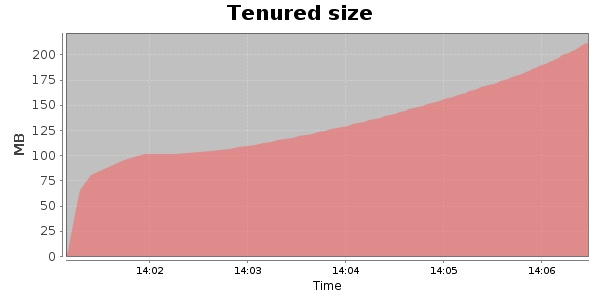
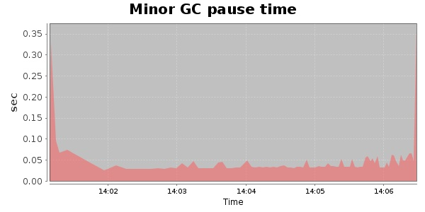
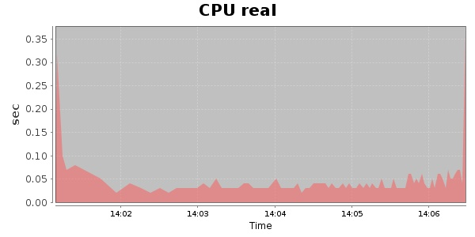
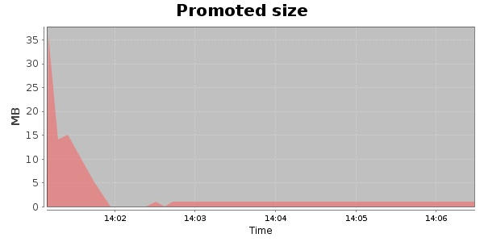
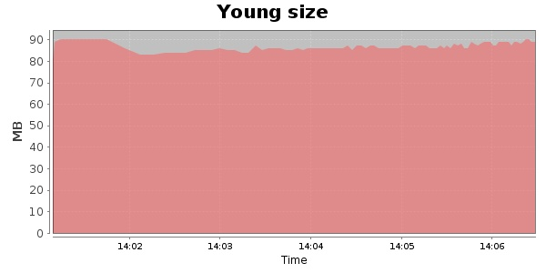

### Gatling-1.5.3 10000 Users
#### https://flood.io/04f7b780d73b20
#### Apdex 0.95 [4000]
This flood simulated up to 4,960 concurrent users for 5 minutes on  2013-10-05 14:01:00 UTC from Australia (Sydney). A mean response time of 1,676 ms was observed with a standard deviation of 60 ms. The 95th percentile was 1,710 ms and the 50th percentile (median) was 1,697 ms. A mean throughput of 986 kbps was observed with a peak of 1.30 Mbps. A total of 43.3 MB was transferred. A total of 46,025 requests were successfully simulated with an error rate of 0.01% observed. The mean request rate was 9,205.00 rpm. 

\
\
\
\
\

