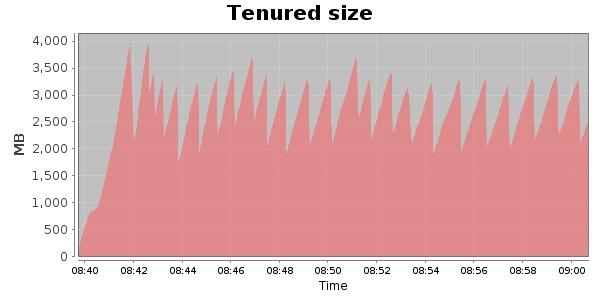
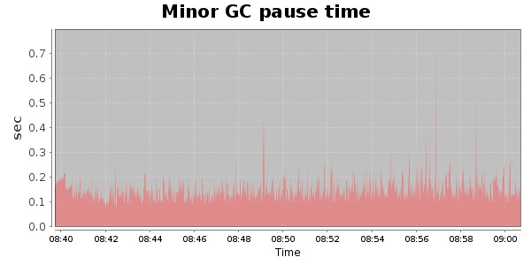
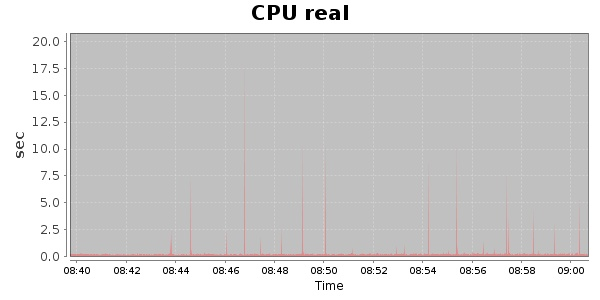
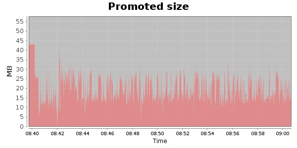
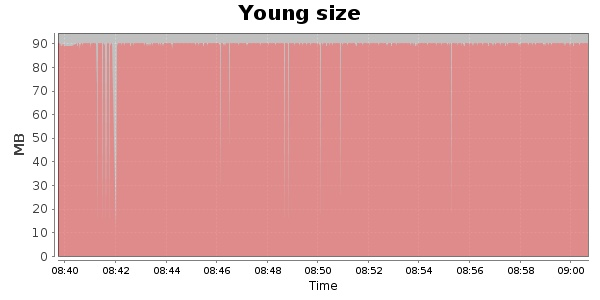

### JMeter-2.9 Kludge 30000 Users
#### https://flood.io/0ea10ce79e0ae4
#### Apdex 0.9 [4000]
This flood simulated up to 18,876 concurrent users for 20 minutes on  2013-10-05 08:40:00 UTC from Australia (Sydney). A mean response time of 2,116 ms was observed with a standard deviation of 1,105 ms. The 95th percentile was 2,288 ms and the 50th percentile (median) was 1,872 ms. A mean throughput of 1.33 Mbps was observed with a peak of 1.97 Mbps. A total of 209 MB was transferred. A total of 388,127 requests were successfully simulated with no errors observed. The mean request rate was 19,406.00 rpm. 

\
\
\
\
\

