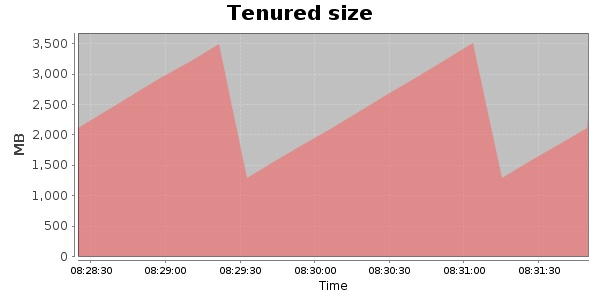
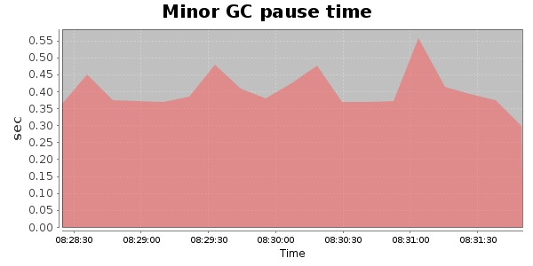
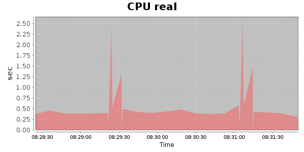
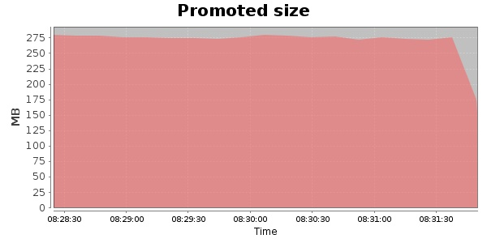
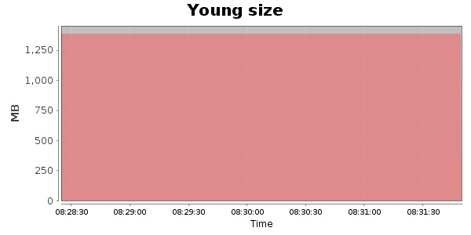

### JMeter-2.9 10000 Users
#### https://flood.io/0f7089e8a25683
#### Apdex 0.4 [1600]
This flood simulated up to 10,000 concurrent users for 3 minutes on  2013-09-30 08:28:00 UTC from Australia (Sydney). A mean response time of 1,653 ms was observed with a standard deviation of 119 ms. The 95th percentile was 1,718 ms and the 50th percentile (median) was 1,711 ms. A mean throughput of 879 kbps was observed with a peak of 1.29 Mbps. A total of 25.7 MB was transferred. A total of 95,426 requests were successfully simulated with no errors observed. The mean request rate was 31,808.00 rpm. 

\
\
\
\
\

