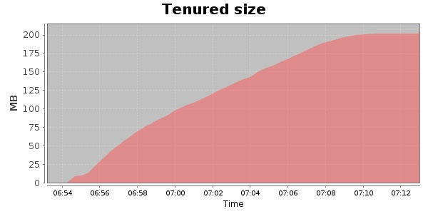
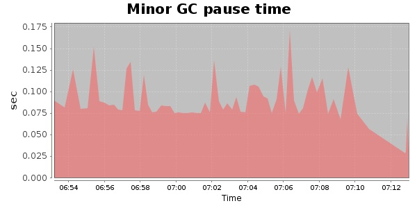
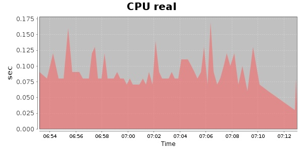
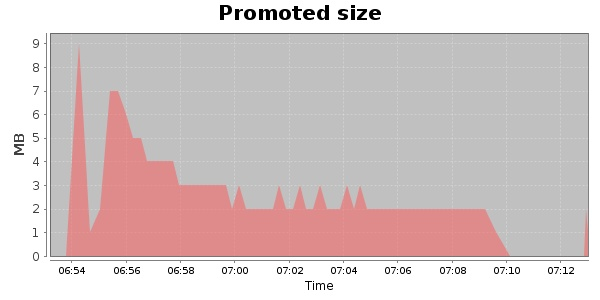
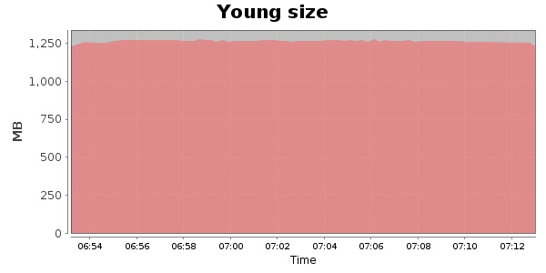

### Gatling-1.5.3 20000 Users
#### https://flood.io/1cf455229dea6c
#### Apdex 0.95 [4000]
This flood simulated up to 20,000 concurrent users for 19 minutes on  2013-10-01 06:53:00 UTC from Australia (Sydney). A mean response time of 1,674 ms was observed with a standard deviation of 150 ms. The 95th percentile was 1,723 ms and the 50th percentile (median) was 1,707 ms. A mean throughput of 1.18 Mbps was observed with a peak of 5.13 Mbps. A total of 177 MB was transferred. A total of 573,762 requests were successfully simulated with an error rate of 0.0% observed. The mean request rate was 30,198.00 rpm. 

\
\
\
\
\

