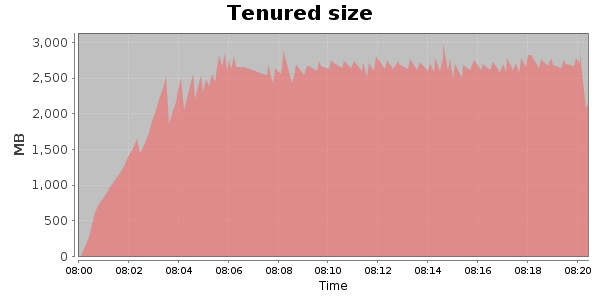
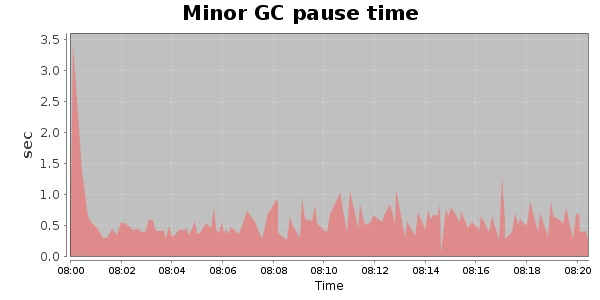
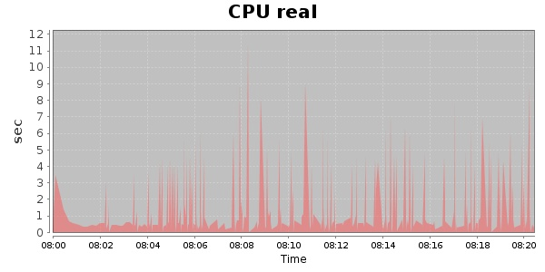
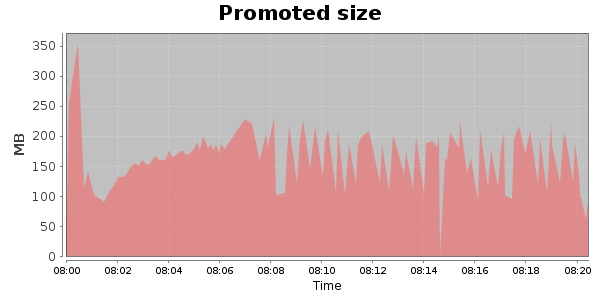
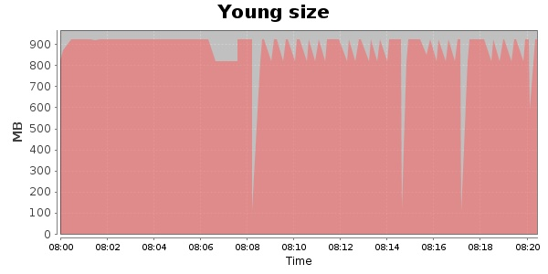

### JMeter-2.9 20000 Users
#### https://flood.io/2037deb43774de
#### Apdex 0.87 [4000]
This flood simulated up to 20,000 concurrent users for 20 minutes on  2013-10-01 08:00:00 UTC from Australia (Sydney). A mean response time of 2,637 ms was observed with a standard deviation of 1,015 ms. The 95th percentile was 3,750 ms and the 50th percentile (median) was 2,540 ms. A mean throughput of 1.04 Mbps was observed with a peak of 1.67 Mbps. A total of 163 MB was transferred. A total of 518,098 requests were successfully simulated with no errors observed. The mean request rate was 25,904.00 rpm. 

\
\
\
\
\

