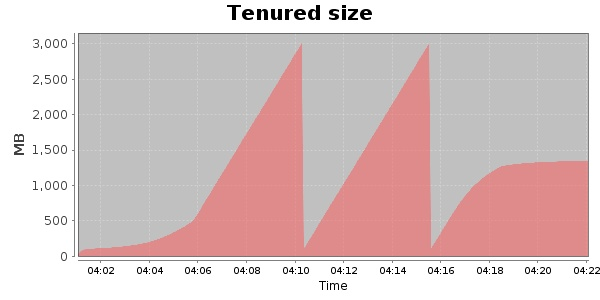
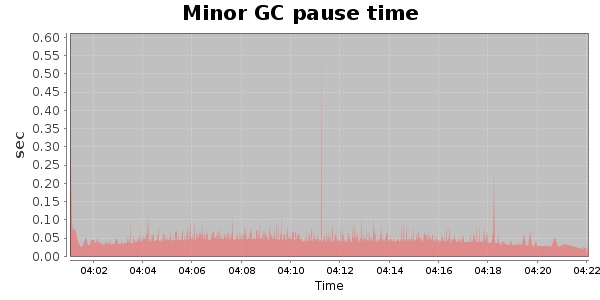
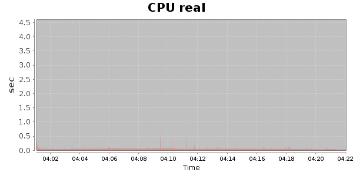
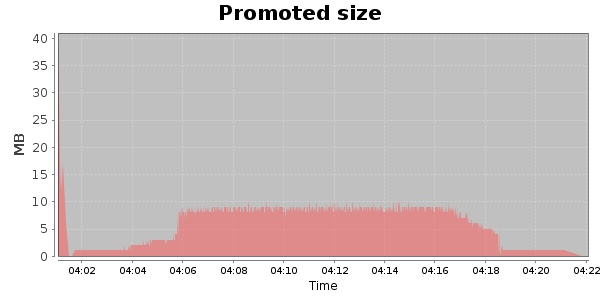

###  20000 Users
#### https://flood.io/23e0e008ac349f
#### Apdex 0.95 [4000]
This flood simulated up to 20,000 concurrent users for 20 minutes on  2013-10-04 04:01:00 UTC from Australia (Sydney). A mean response time of 1,705 ms was observed with a standard deviation of 56 ms. The 95th percentile was 1,730 ms and the 50th percentile (median) was 1,705 ms. A mean throughput of 1.18 Mbps was observed with a peak of 5.02 Mbps. A total of 185 MB was transferred. A total of 576,563 requests were successfully simulated with no errors observed. The mean request rate was 28,828.00 rpm. 

\
\
\
\
\

