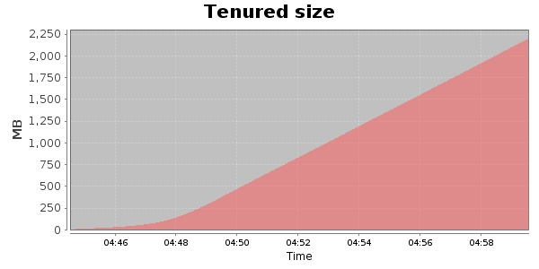
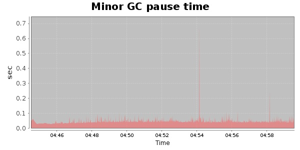
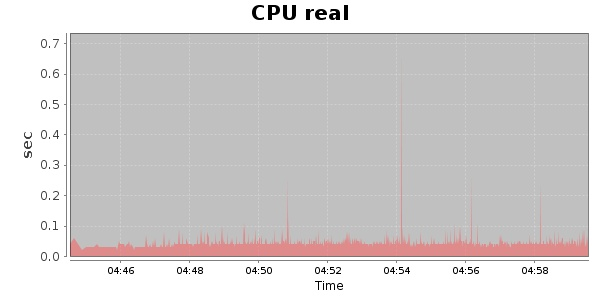
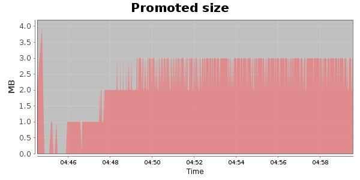
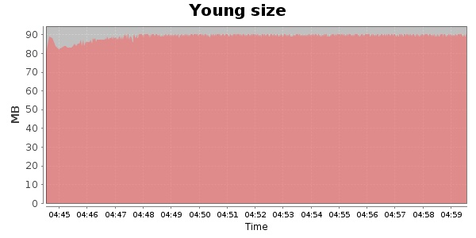

### Gatling-2.0.0-20131003.084332-335-bundle 20000 Users
#### https://flood.io/24a56644a3e9fa
#### Apdex 0.95 [4000]
This flood simulated up to 19,999 concurrent users for 15 minutes on  2013-10-04 04:44:00 UTC from Australia (Sydney). A mean response time of 1,707 ms was observed with a standard deviation of 46 ms. The 95th percentile was 1,847 ms and the 50th percentile (median) was 1,704 ms. A mean throughput of 1.58 Mbps was observed with a peak of 5.11 Mbps. A total of 190 MB was transferred. A total of 475,390 requests were successfully simulated with no errors observed. The mean request rate was 31,692.00 rpm. 

\
\
\
\
\

