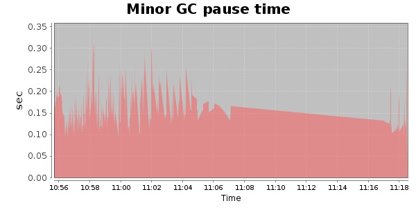
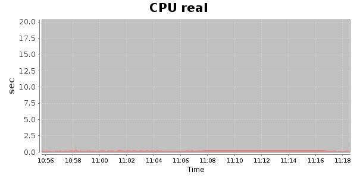
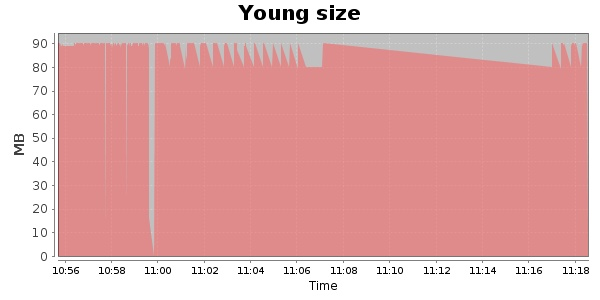

### JMeter-2.9 30000 Users
#### https://flood.io/281e7285b26e08
#### Apdex 0.18 [4000]
This flood simulated up to 30,000 concurrent users for 22 minutes on  2013-10-04 10:56:00 UTC from Australia (Sydney). A mean response time of 259,847 ms was observed with a standard deviation of 252,112 ms. The 95th percentile was 732,720 ms and the 50th percentile (median) was 207,120 ms. A mean throughput of 415 kbps was observed with a peak of 1.41 Mbps. A total of 69.9 MB was transferred. A total of 147,607 requests were successfully simulated with no errors observed. The mean request rate was 6,709.00 rpm. 

\
\
\
\
\

