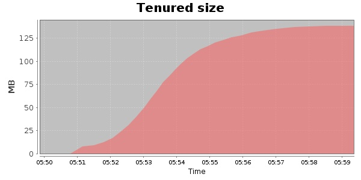
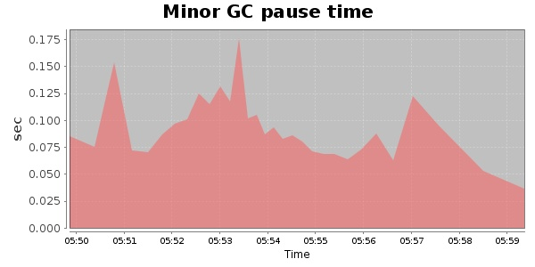
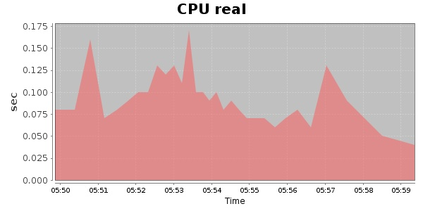
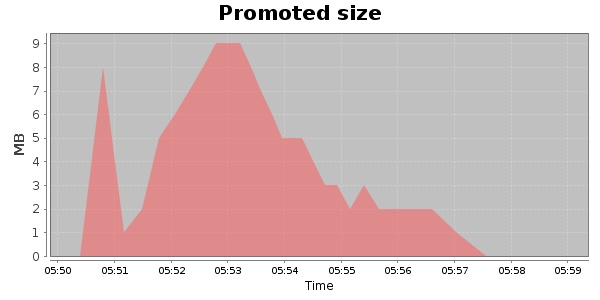
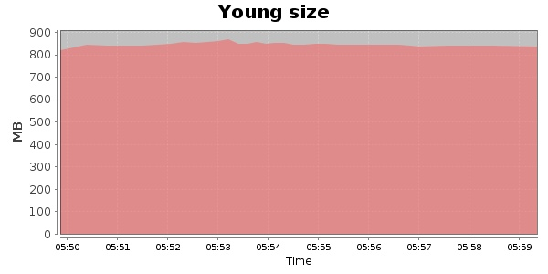

### Gatling-1.5.3 10000 Users
#### https://flood.io/28d5ba5785ea93
#### Apdex 0.79 [300]
This flood simulated up to 10,000 concurrent users for 9 minutes on  2013-09-30 05:49:00 UTC from Australia (Sydney). A mean response time of 316 ms was observed with a standard deviation of 27 ms. The 95th percentile was 395 ms and the 50th percentile (median) was 309 ms. A mean throughput of 8.91 Mbps was observed with a peak of 16.85 Mbps. A total of 668 MB was transferred. A total of 196,245 requests were successfully simulated with an error rate of 0.0% observed. The mean request rate was 21,805.00 rpm. 

\
\
\
\
\

