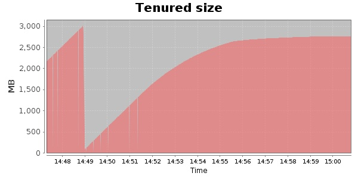
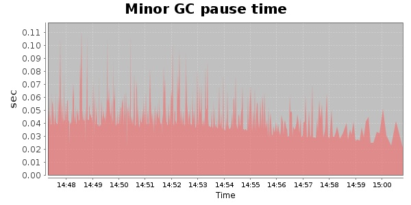
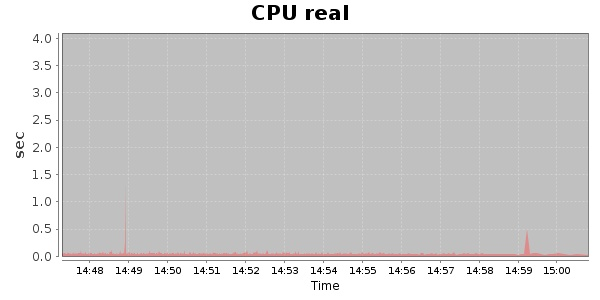
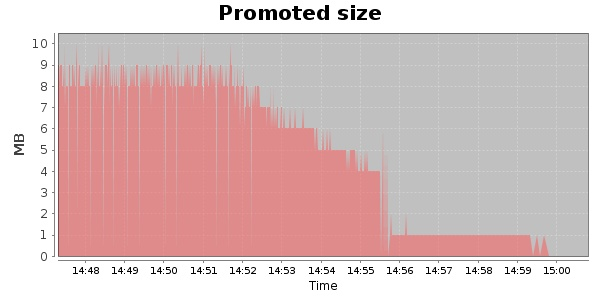
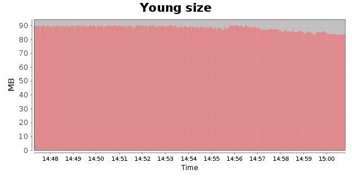

### Gatling-1.5.3 10000 Users
#### https://flood.io/2b930982efff3d
#### Apdex 0.95 [4000]
This flood simulated up to 10,000 concurrent users for 14 minutes on  2013-10-02 14:47:00 UTC from Australia (Sydney). A mean response time of 1,695 ms was observed with a standard deviation of 60 ms. The 95th percentile was 1,765 ms and the 50th percentile (median) was 1,708 ms. A mean throughput of 0 bps was observed with a peak of 0 bps. A total of 0 Bytes was transferred. A total of 326,489 requests were successfully simulated with no errors observed. The mean request rate was 23,320.00 rpm. 

\
\
\
\
\

