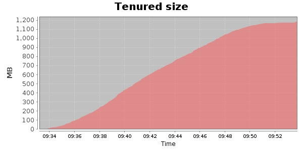
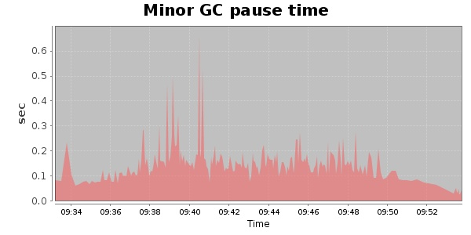
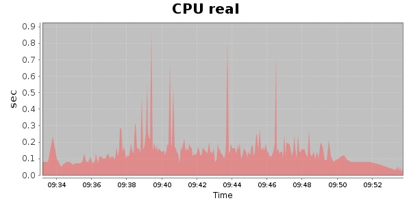
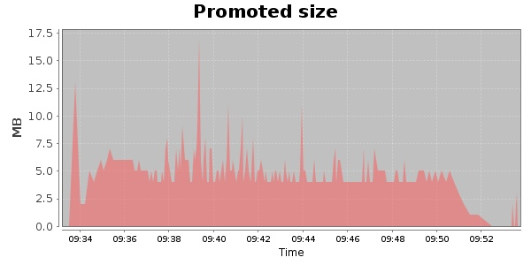
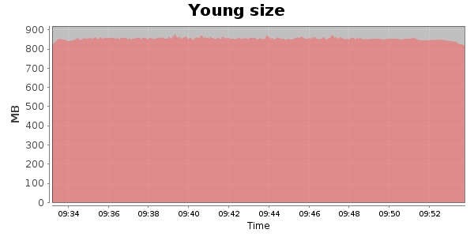

### Gatling-1.5.3 40000 Users
#### https://flood.io/2c13788664d83d
#### Apdex 0.95 [4000]
This flood simulated up to 40,000 concurrent users for 19 minutes on  2013-10-01 09:33:00 UTC from Australia (Sydney). A mean response time of 1,574 ms was observed with a standard deviation of 111 ms. The 95th percentile was 1,719 ms and the 50th percentile (median) was 1,509 ms. A mean throughput of 2.49 Mbps was observed with a peak of 9.86 Mbps. A total of 374 MB was transferred. A total of 992,850 requests were successfully simulated with an error rate of 14.11% observed. The mean request rate was 60,842.00 rpm. 

\
\
\
\
\

