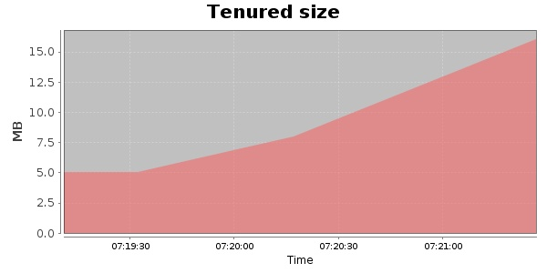
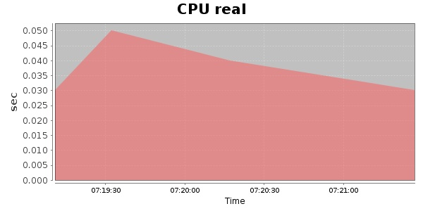
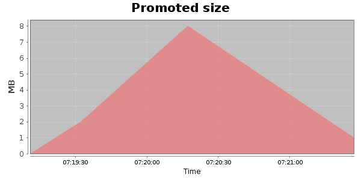
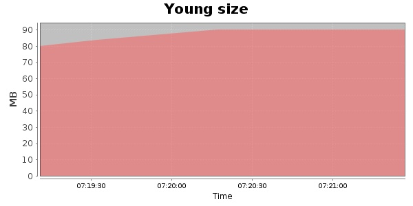

### JMeter-2.10 100 Users
#### https://flood.io/2d93bff1fadb8e
#### Apdex 0.96 [4000]
This flood simulated up to 100 concurrent users for 1 minute on  2013-10-02 07:19:00 UTC from Australia (Sydney). A mean response time of 1,603 ms was observed with a standard deviation of 23 ms. The 95th percentile was 1,619 ms and the 50th percentile (median) was 1,603 ms. A mean throughput of 17 kbps was observed with a peak of 20 kbps. A total of 258 KB was transferred. A total of 527 requests were successfully simulated with no errors observed. The mean request rate was 527.00 rpm. 

\
\
\
\
\

