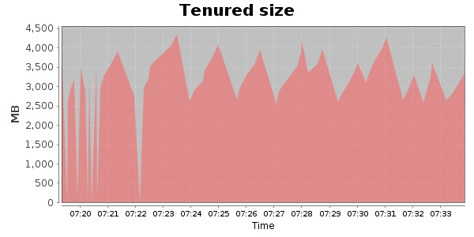
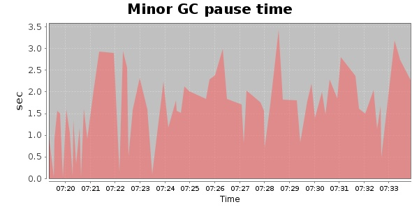
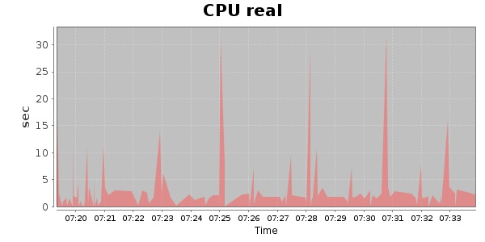
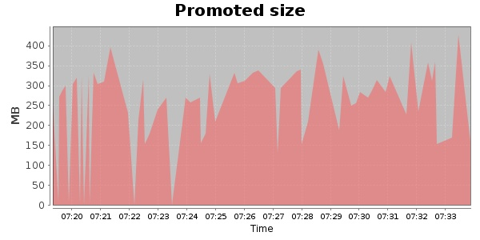
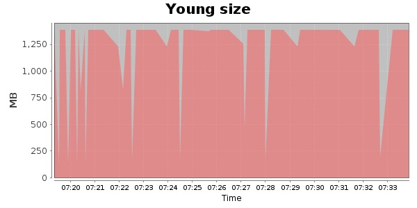

### JMeter-2.9 20000 Users
#### https://flood.io/33ebc2c90560f0
#### Apdex 0.96 [4000]
This flood simulated up to 4,117 concurrent users for 1 minute on  2013-10-01 07:13:00 UTC from Australia (Sydney). A mean response time of 1,214 ms was observed with a standard deviation of 843 ms. The 95th percentile was 1,811 ms and the 50th percentile (median) was 1,214 ms. A mean throughput of 129 kbps was observed with a peak of 197 kbps. A total of 1.88 MB was transferred. A total of 2,003 requests were successfully simulated with no errors observed. The mean request rate was 2,003.00 rpm. 

\
\
\
\
\

