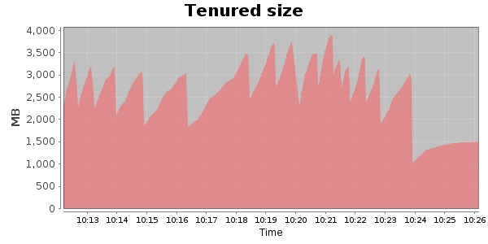
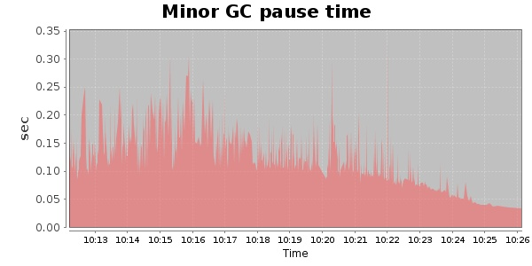
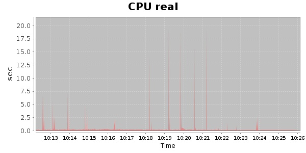
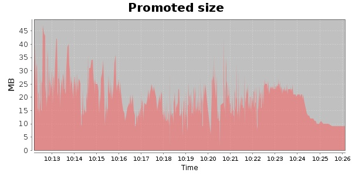
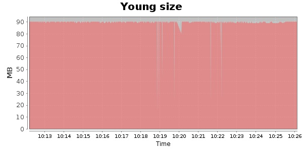

### JMeter-2.9 Kludge 30000 Users
#### https://flood.io/348f997ed2dab8
#### Apdex 0.87 [4000]
This flood simulated up to 17,737 concurrent users for 16 minutes on  2013-10-05 10:11:00 UTC from Australia (Sydney). A mean response time of 2,206 ms was observed with a standard deviation of 647 ms. The 95th percentile was 4,043 ms and the 50th percentile (median) was 1,916 ms. A mean throughput of 782 kbps was observed with a peak of 1.77 Mbps. A total of 97.4 MB was transferred. A total of 218,947 requests were successfully simulated with no errors observed. The mean request rate was 13,684.00 rpm. 

\
\
\
\
\

