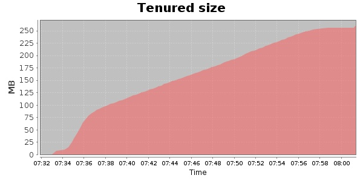
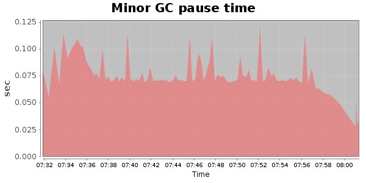
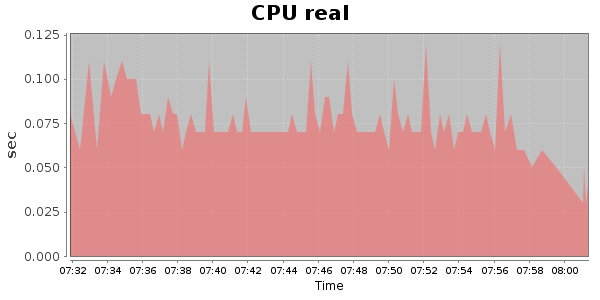
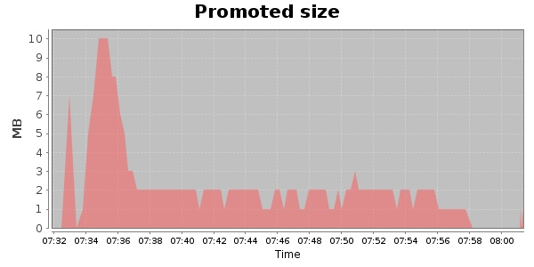
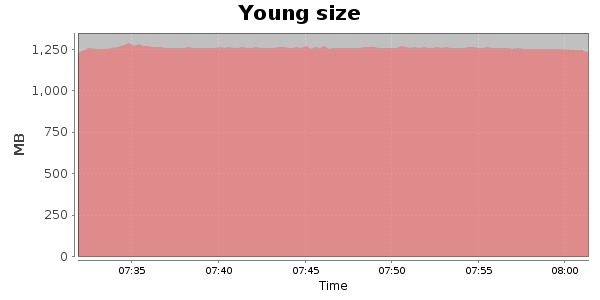

### Gatling-1.5.3 10000 Users
#### https://flood.io/38e95e789a9908
#### Apdex 0.4 [1600]
This flood simulated up to 10,000 concurrent users for 30 minutes on  2013-09-30 07:30:00 UTC from Australia (Sydney). A mean response time of 1,717 ms was observed with a standard deviation of 51 ms. The 95th percentile was 1,737 ms and the 50th percentile (median) was 1,709 ms. A mean throughput of 424 kbps was observed with a peak of 2.66 Mbps. A total of 96.2 MB was transferred. A total of 902,482 requests were successfully simulated with no errors observed. The mean request rate was 30,082.00 rpm. 

\
\
\
\
\

