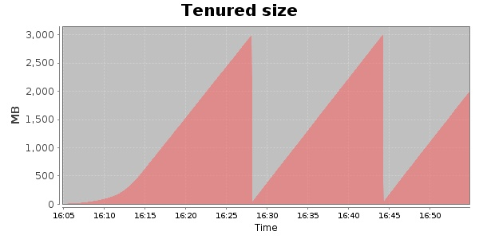
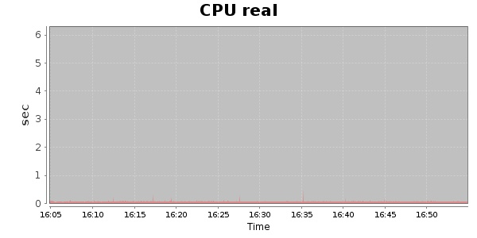
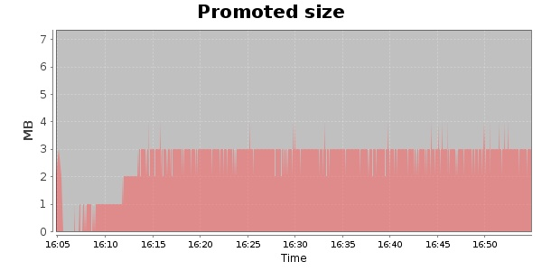
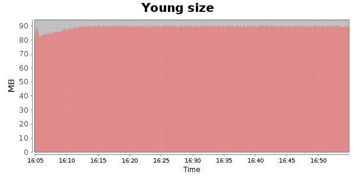

### Gatling-2.0.0-20131002.164439-333-bundle 10000 Users
#### https://flood.io/402cd50f91467b
#### Apdex 0.95 [4000]
This flood simulated up to 9,999 concurrent users for about 1 hour on  2013-10-03 16:05:00 UTC from Australia (Sydney). A mean response time of 1,704 ms was observed with a standard deviation of 16 ms. The 95th percentile was 1,717 ms and the 50th percentile (median) was 1,704 ms. A mean throughput of 258 kbps was observed with a peak of 1.34 Mbps. A total of 94.4 MB was transferred. A total of 1,616,549 requests were successfully simulated with no errors observed. The mean request rate was 32,990.00 rpm. 

\
\
\
\
\

