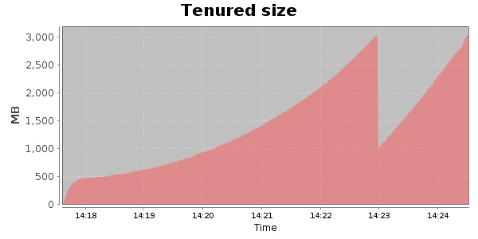
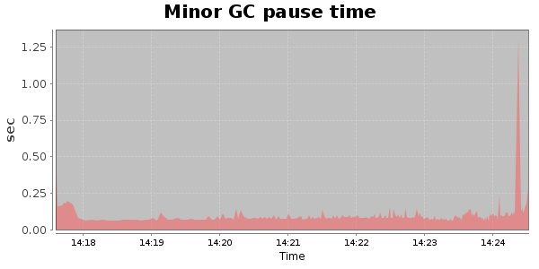
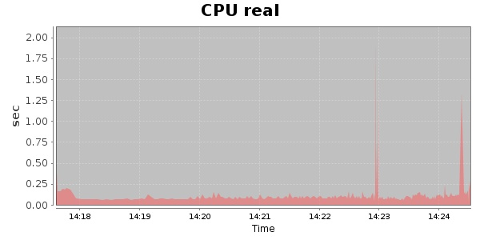
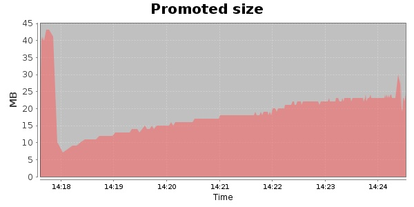
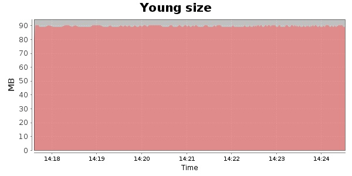

### JMeter-r1529379 10000 Users
#### https://flood.io/4238fc7e101136
#### Apdex 0.96 [4000]
This flood simulated up to 6,605 concurrent users for 7 minutes on  2013-10-05 14:17:00 UTC from Australia (Sydney). A mean response time of 1,609 ms was observed with a standard deviation of 130 ms. The 95th percentile was 1,696 ms and the 50th percentile (median) was 1,668 ms. A mean throughput of 469 kbps was observed with a peak of 906 kbps. A total of 27.5 MB was transferred. A total of 75,771 requests were successfully simulated with no errors observed. The mean request rate was 10,824.00 rpm. 

\
\
\
\
\

