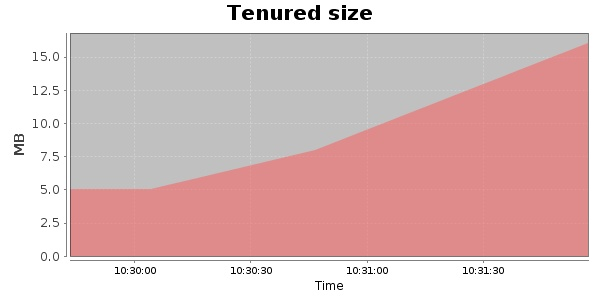
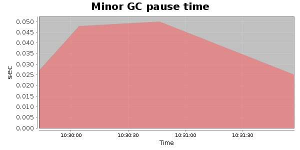
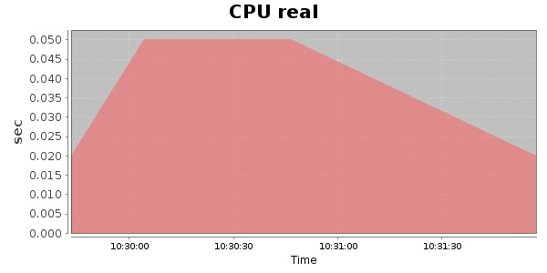
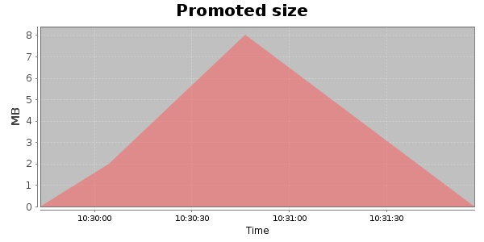
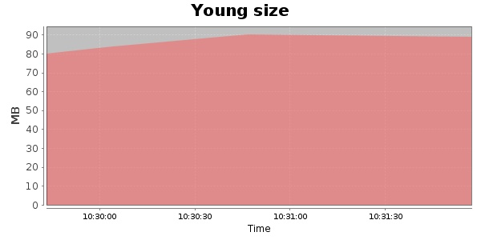

### JMeter-2.9 100 Users
#### https://flood.io/4ab9feb117064d
#### Apdex 0.97 [4000]
This flood simulated up to 100 concurrent users for 2 minutes on  2013-10-02 10:29:00 UTC from Australia (Sydney). A mean response time of 1,130 ms was observed with a standard deviation of 942 ms. The 95th percentile was 1,706 ms and the 50th percentile (median) was 1,642 ms. A mean throughput of 13 kbps was observed with a peak of 27 kbps. A total of 285 KB was transferred. A total of 611 requests were successfully simulated with no errors observed. The mean request rate was 305.00 rpm. 

\
\
\
\
\

