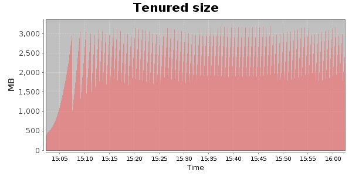
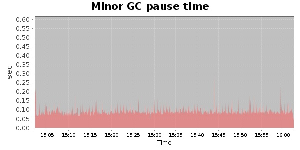
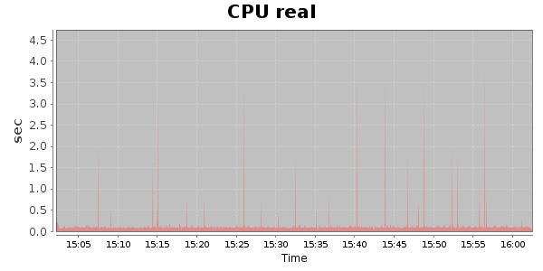
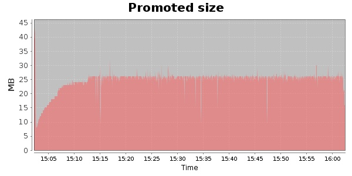
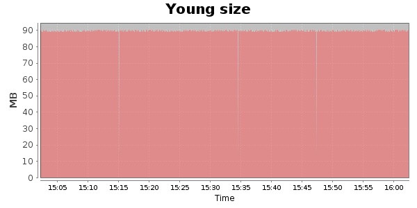

### JMeter-2.9 10000 Users
#### https://flood.io/4ba5ec4844fae0
#### Apdex 0.95 [4000]
This flood simulated up to 10,000 concurrent users for about 1 hour on  2013-10-02 15:02:00 UTC from Australia (Sydney). A mean response time of 1,702 ms was observed with a standard deviation of 34 ms. The 95th percentile was 1,717 ms and the 50th percentile (median) was 1,712 ms. A mean throughput of 1.19 Mbps was observed with a peak of 1.39 Mbps. A total of 543 MB was transferred. A total of 1,971,712 requests were successfully simulated with no errors observed. The mean request rate was 32,861.00 rpm. 

\
\
\
\
\

