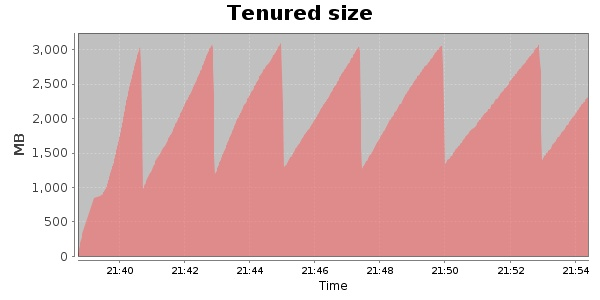
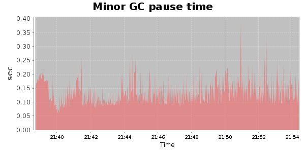
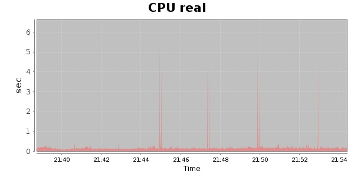
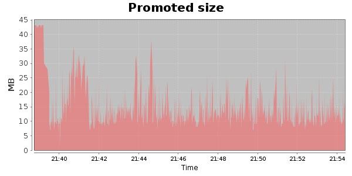
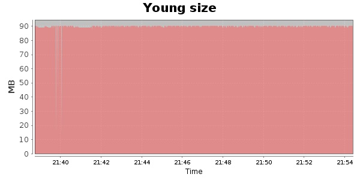

### JMeter-2.9 Kludge 30000 Users
#### https://flood.io/4d2450d341a3d2
#### Apdex 0.94 [4000]
This flood simulated up to 10,152 concurrent users for 15 minutes on  2013-10-05 21:39:00 UTC from Australia (Sydney). A mean response time of 1,779 ms was observed with a standard deviation of 139 ms. The 95th percentile was 2,110 ms and the 50th percentile (median) was 1,763 ms. A mean throughput of 662 kbps was observed with a peak of 1.11 Mbps. A total of 77.6 MB was transferred. A total of 104,000 requests were successfully simulated with no errors observed. The mean request rate was 6,933.00 rpm. 

\
\
\
\
\

