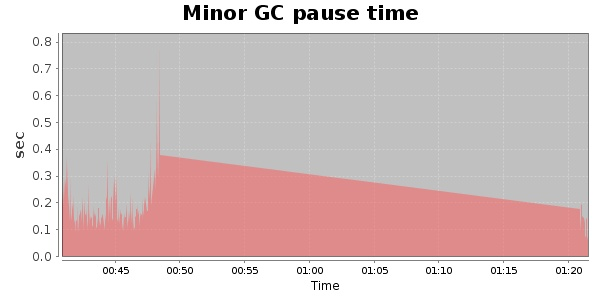
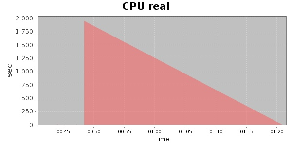
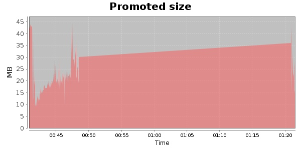
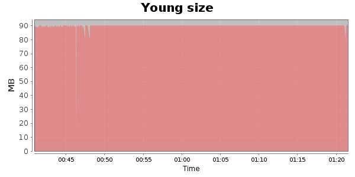

### JMeter-2.9 20000 Users
#### https://flood.io/507945f1702bad
#### Apdex 0.84 [4000]
This flood simulated up to 20,000 concurrent users for 40 minutes on  2013-10-02 00:41:00 UTC from Australia (Sydney). A mean response time of 3,946 ms was observed with a standard deviation of 4,905 ms. The 95th percentile was 15,163 ms and the 50th percentile (median) was 1,735 ms. A mean throughput of 895 kbps was observed with a peak of 1.70 Mbps. A total of 65.5 MB was transferred. A total of 161,292 requests were successfully simulated with no errors observed. The mean request rate was 4,032.00 rpm. 

\
\
\
\
\

