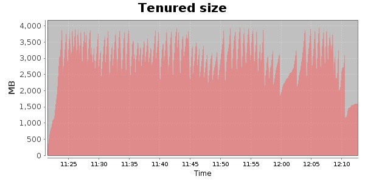
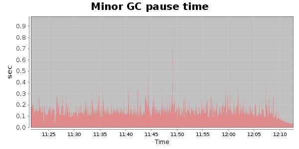
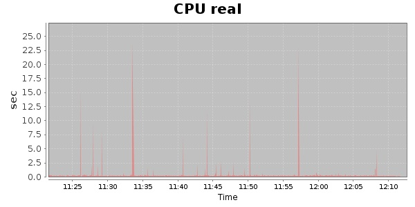
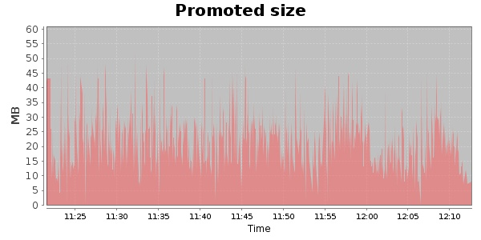
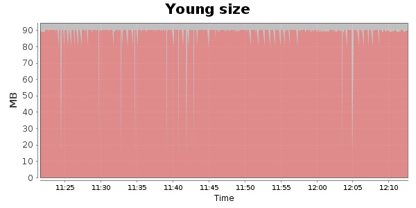

### JMeter-2.9 Kludge 30000 Users
#### https://flood.io/52626555a22ecd
#### Apdex 0.79 [4000]
This flood simulated up to 24,025 concurrent users for about 1 hour on  2013-10-05 11:22:00 UTC from Australia (Sydney). A mean response time of 3,489 ms was observed with a standard deviation of 2,443 ms. The 95th percentile was 8,469 ms and the 50th percentile (median) was 2,614 ms. A mean throughput of 1.12 Mbps was observed with a peak of 1.88 Mbps. A total of 444 MB was transferred. A total of 993,407 requests were successfully simulated with no errors observed. The mean request rate was 19,103.00 rpm. 

\
\
\
\
\

