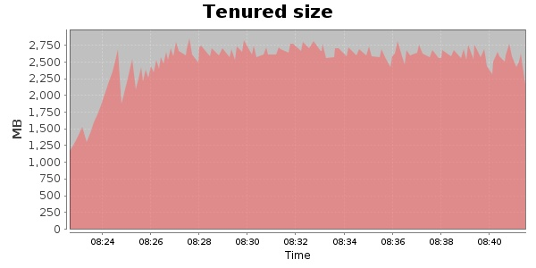
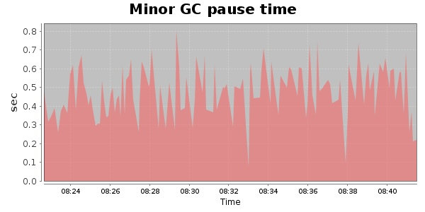
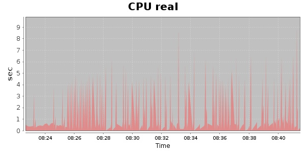
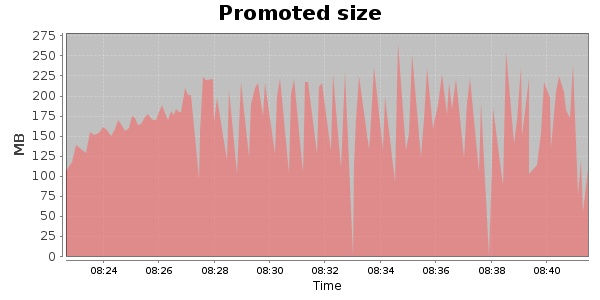
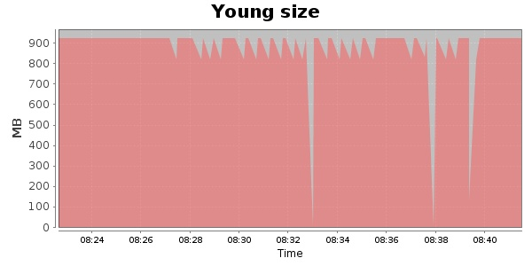

### JMeter-2.10 20000 Users
#### https://flood.io/57b90939e21846
#### Apdex 0.91 [4000]
This flood simulated up to 20,000 concurrent users for 19 minutes on  2013-10-01 08:22:00 UTC from Australia (Sydney). A mean response time of 2,143 ms was observed with a standard deviation of 446 ms. The 95th percentile was 2,854 ms and the 50th percentile (median) was 2,163 ms. A mean throughput of 1.07 Mbps was observed with a peak of 1.69 Mbps. A total of 160 MB was transferred. A total of 525,833 requests were successfully simulated with no errors observed. The mean request rate was 27,675.00 rpm. 

\
\
\
\
\

