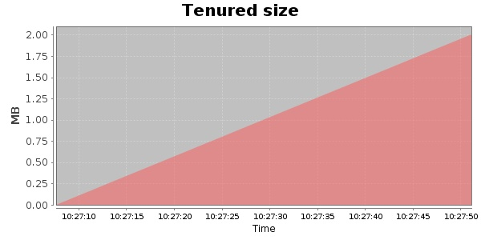
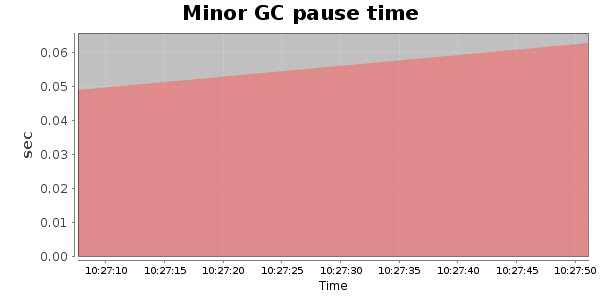
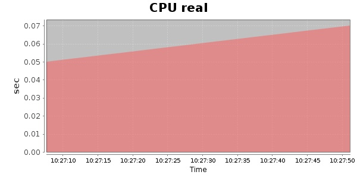
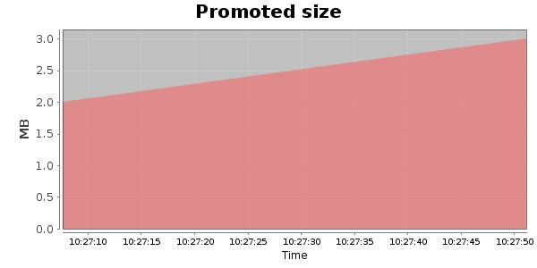
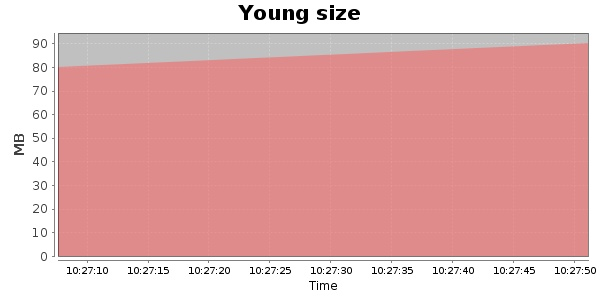

### Gatling-1.5.3 100 Users
#### https://flood.io/5bdd2601b9fb3c
#### Apdex 0.93 [4000]
This flood simulated up to 100 concurrent users for 1 minute on  2013-10-02 10:27:00 UTC from Australia (Sydney). A mean response time of 1,931 ms was observed with a standard deviation of 243 ms. The 95th percentile was 2,103 ms and the 50th percentile (median) was 1,931 ms. A mean throughput of 18 kbps was observed with a peak of 24 kbps. A total of 269 KB was transferred. A total of 454 requests were successfully simulated with no errors observed. The mean request rate was 454.00 rpm. 

\
\
\
\
\

