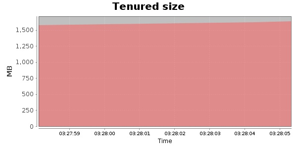
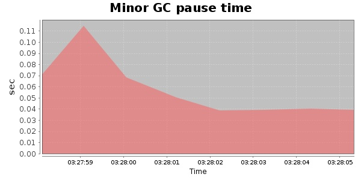
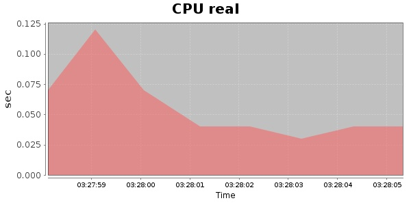
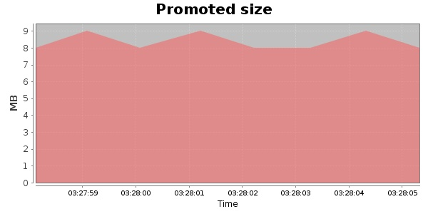
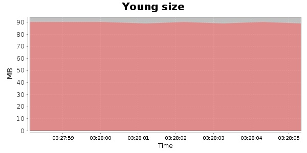

### Gatling-1.5.3 10000 Users
#### https://flood.io/5d95ccbdbe02df
#### Apdex 0.95 [4000]
This flood simulated up to 2,131 concurrent users for 2 minutes on  2013-10-05 03:12:00 UTC from Australia (Sydney). A mean response time of 1,759 ms was observed with a standard deviation of 268 ms. The 95th percentile was 2,056 ms and the 50th percentile (median) was 1,691 ms. A mean throughput of 587 kbps was observed with a peak of 1.20 Mbps. A total of 12.9 MB was transferred. A total of 7,851 requests were successfully simulated with no errors observed. The mean request rate was 3,925.00 rpm. 

\
\
\
\
\

