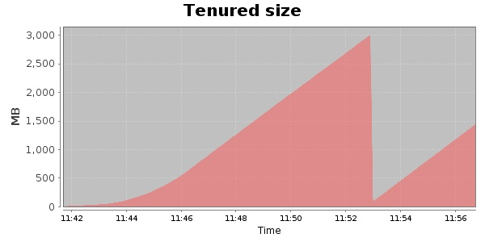
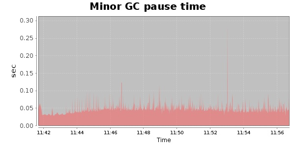
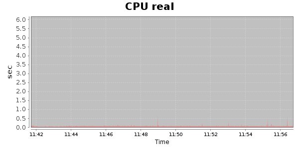
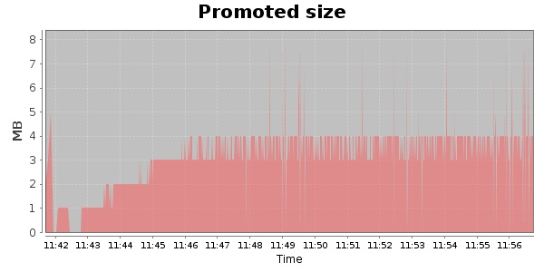
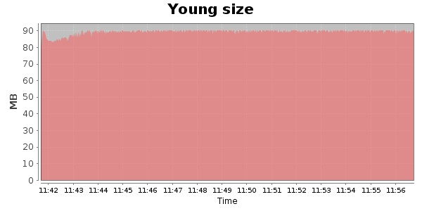

### Gatling-2.0.0-20131003.084332-335-bundle 30000 Users
#### https://flood.io/5f9a354d37f077
#### Apdex 0.95 [4000]
This flood simulated up to 29,999 concurrent users for 14 minutes on  2013-10-04 11:42:00 UTC from Australia (Sydney). A mean response time of 1,710 ms was observed with a standard deviation of 27 ms. The 95th percentile was 1,790 ms and the 50th percentile (median) was 1,710 ms. A mean throughput of 2.45 Mbps was observed with a peak of 7.58 Mbps. A total of 276 MB was transferred. A total of 717,777 requests were successfully simulated with no errors observed. The mean request rate was 51,269.00 rpm. 

\
\
\
\
\

