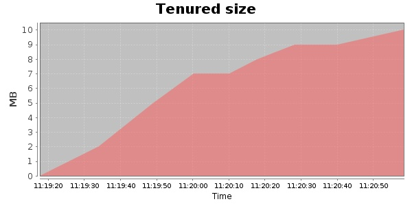
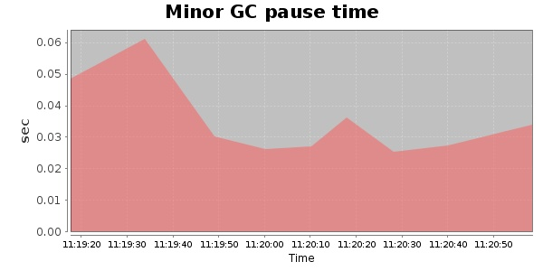
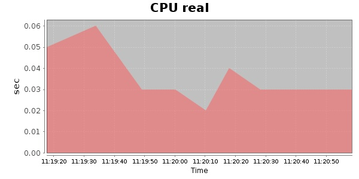
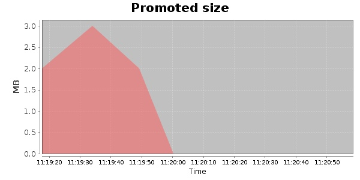
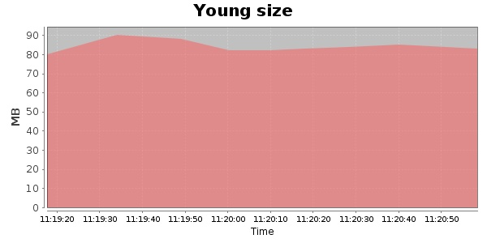

### Gatling-1.5.3 1000 Users
#### https://flood.io/60438b3ba7ff40
#### Apdex 0.96 [4000]
This flood simulated up to 1,000 concurrent users for 2 minutes on  2013-10-02 11:19:00 UTC from Australia (Sydney). A mean response time of 1,635 ms was observed with a standard deviation of 375 ms. The 95th percentile was 1,966 ms and the 50th percentile (median) was 1,713 ms. A mean throughput of 262 kbps was observed with a peak of 623 kbps. A total of 5.76 MB was transferred. A total of 3,222 requests were successfully simulated with no errors observed. The mean request rate was 1,611.00 rpm. 

\
\
\
\
\

