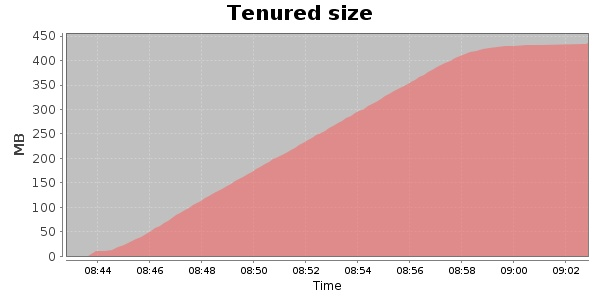
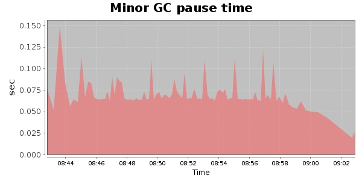
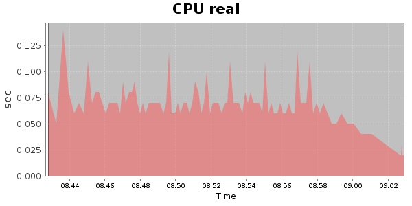
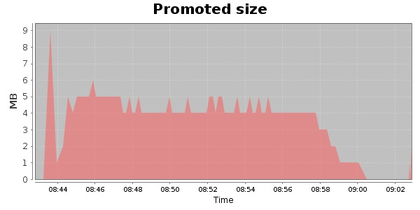
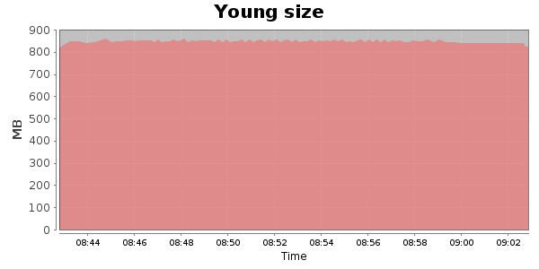

### Gatling-1.5.3 20000 Users
#### https://flood.io/6666b6bc4cb8a2
#### Apdex 0.95 [4000]
This flood simulated up to 20,000 concurrent users for 20 minutes on  2013-10-01 08:42:00 UTC from Australia (Sydney). A mean response time of 1,702 ms was observed with a standard deviation of 28 ms. The 95th percentile was 1,731 ms and the 50th percentile (median) was 1,704 ms. A mean throughput of 1.22 Mbps was observed with a peak of 5.06 Mbps. A total of 192 MB was transferred. A total of 578,228 requests were successfully simulated with no errors observed. The mean request rate was 28,911.00 rpm. 

\
\
\
\
\

