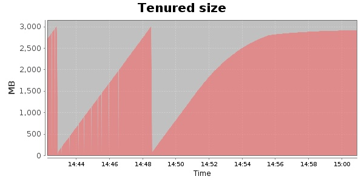
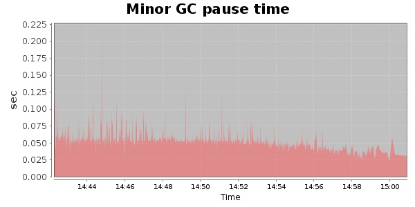
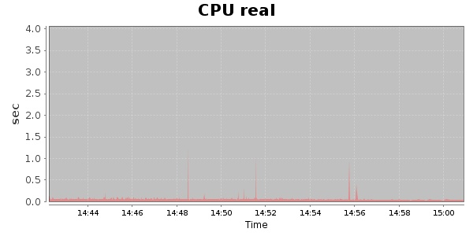
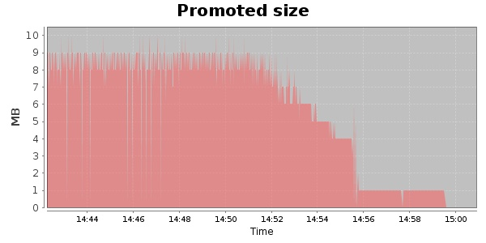
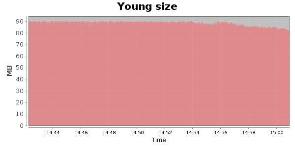

### Gatling-1.5.3 10000 Users
#### https://flood.io/69ccab50eeccff
#### Apdex 0.95 [4000]
This flood simulated up to 10,000 concurrent users for 18 minutes on  2013-10-06 14:42:00 UTC from Australia (Sydney). A mean response time of 1,709 ms was observed with a standard deviation of 16 ms. The 95th percentile was 1,767 ms and the 50th percentile (median) was 1,706 ms. A mean throughput of 0 bps was observed with a peak of 0 bps. A total of 0 Bytes was transferred. A total of 502,934 requests were successfully simulated with an error rate of 0.0% observed. The mean request rate was 27,942.00 rpm. 

\
\
\
\
\

