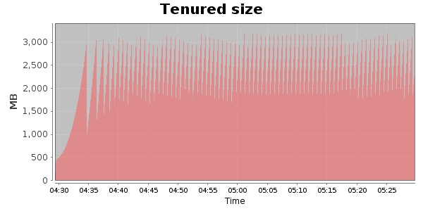
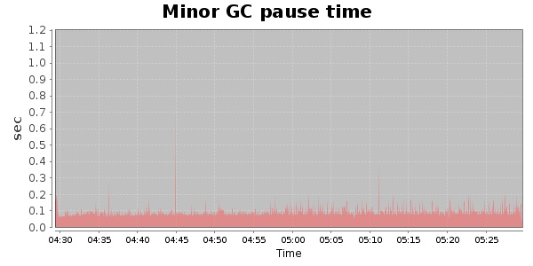
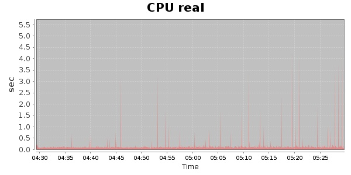
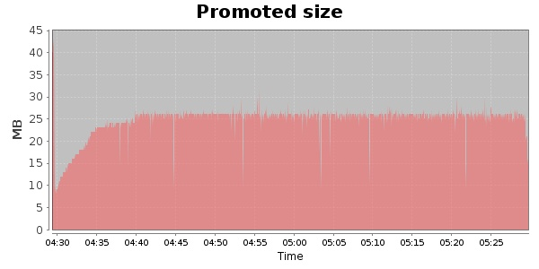
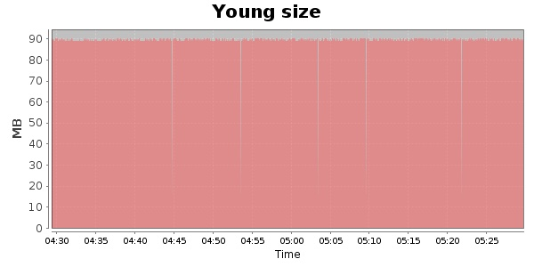

### JMeter-r1529062 10000 Users
#### https://flood.io/700437d8f8d924
#### Apdex 0.95 [4000]
This flood simulated up to 10,000 concurrent users for about 1 hour on  2013-10-05 04:29:00 UTC from Australia (Sydney). A mean response time of 1,706 ms was observed with a standard deviation of 27 ms. The 95th percentile was 1,720 ms and the 50th percentile (median) was 1,713 ms. A mean throughput of 1.18 Mbps was observed with a peak of 1.38 Mbps. A total of 539 MB was transferred. A total of 1,954,642 requests were successfully simulated with no errors observed. The mean request rate was 32,577.00 rpm. 

\
\
\
\
\

