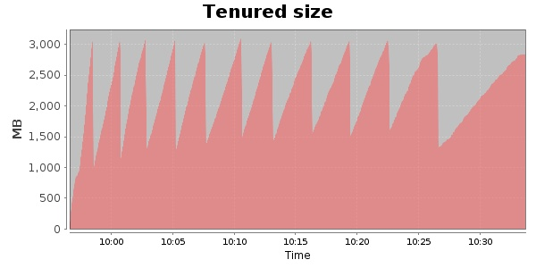
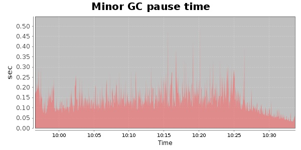
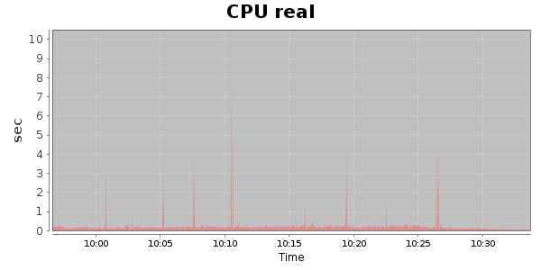
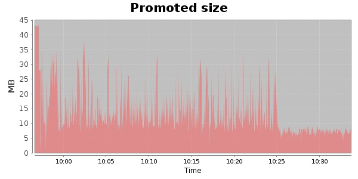

### JMeter-2.9 30000 Users
#### https://flood.io/7d83a8fffb0b5f
#### Apdex 0.94 [4000]
This flood simulated up to 9,809 concurrent users for 36 minutes on  2013-10-04 09:57:00 UTC from Australia (Sydney). A mean response time of 1,790 ms was observed with a standard deviation of 128 ms. The 95th percentile was 2,157 ms and the 50th percentile (median) was 1,772 ms. A mean throughput of 533 kbps was observed with a peak of 1.11 Mbps. A total of 144 MB was transferred. A total of 194,153 requests were successfully simulated with no errors observed. The mean request rate was 5,393.00 rpm. 

\
\
\
\
\

