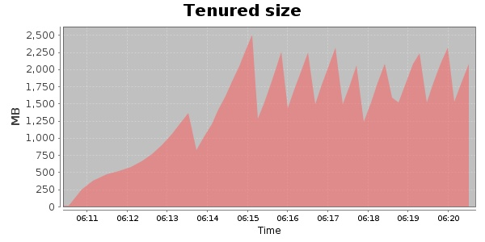
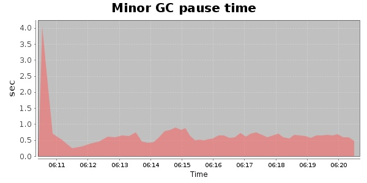
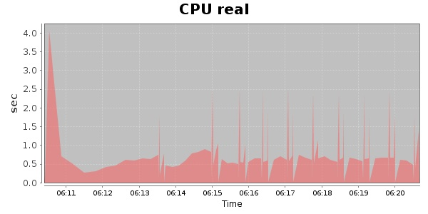
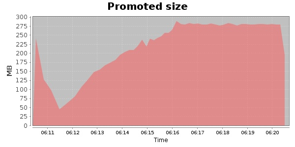
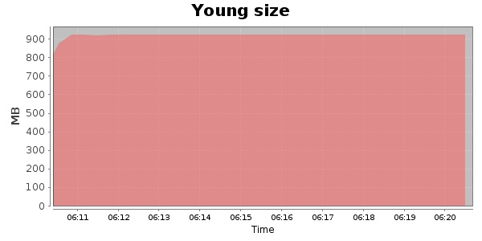

### JMeter-2.10 10000 Users
#### https://flood.io/849fa510312d03
#### Apdex 0.8 [300]
This flood simulated up to 10,000 concurrent users for 9 minutes on  2013-09-30 06:11:00 UTC from Australia (Sydney). A mean response time of 314 ms was observed with a standard deviation of 4 ms. The 95th percentile was 325 ms and the 50th percentile (median) was 314 ms. A mean throughput of 2.39 Mbps was observed with a peak of 3.16 Mbps. A total of 179 MB was transferred. A total of 286,515 requests were successfully simulated with no errors observed. The mean request rate was 31,835.00 rpm. 

\
\
\
\
\

