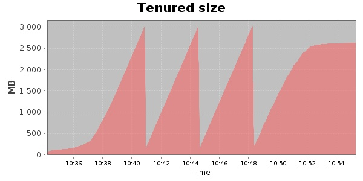
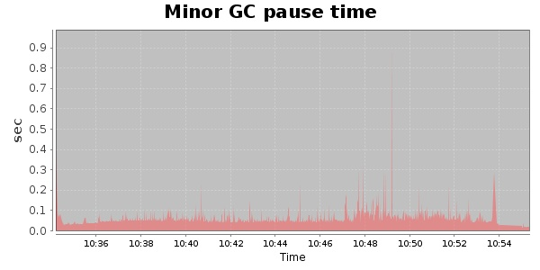
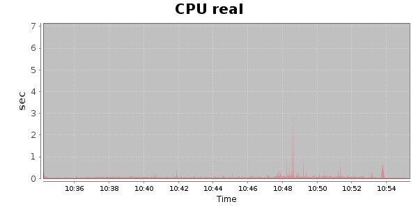
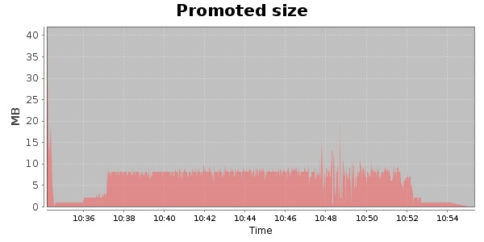
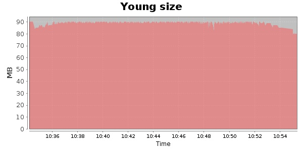

### Gatling-1.5.3 30000 Users
#### https://flood.io/85639de7e9d7e3
#### Apdex 0.95 [4000]
This flood simulated up to 30,000 concurrent users for 19 minutes on  2013-10-04 10:35:00 UTC from Australia (Sydney). A mean response time of 1,710 ms was observed with a standard deviation of 56 ms. The 95th percentile was 1,830 ms and the 50th percentile (median) was 1,706 ms. A mean throughput of 1.77 Mbps was observed with a peak of 7.70 Mbps. A total of 265 MB was transferred. A total of 834,182 requests were successfully simulated with an error rate of 2.98% observed. The mean request rate was 45,251.00 rpm. 

\
\
\
\
\

