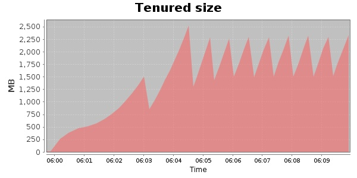
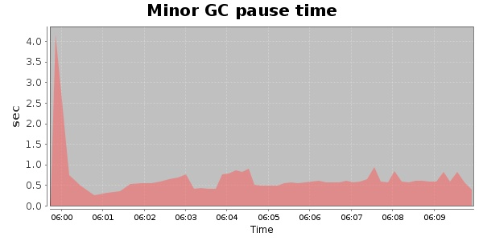
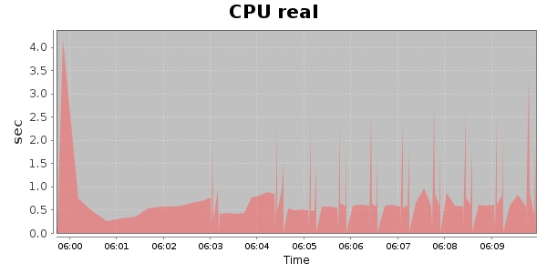
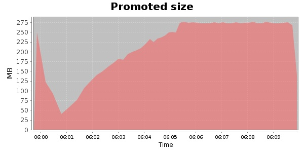
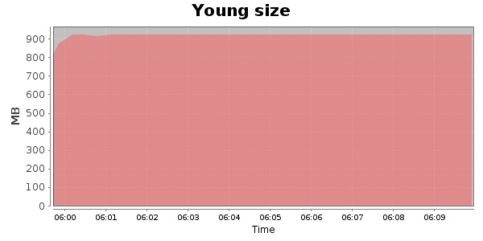

### JMeter-2.9 10000 Users
#### https://flood.io/88c6d7383692ff
#### Apdex 0.79 [300]
This flood simulated up to 10,000 concurrent users for 9 minutes on  2013-09-30 06:00:00 UTC from Australia (Sydney). A mean response time of 321 ms was observed with a standard deviation of 14 ms. The 95th percentile was 361 ms and the 50th percentile (median) was 315 ms. A mean throughput of 2.41 Mbps was observed with a peak of 3.21 Mbps. A total of 181 MB was transferred. A total of 287,837 requests were successfully simulated with no errors observed. The mean request rate was 31,981.00 rpm. 

\
\
\
\
\

