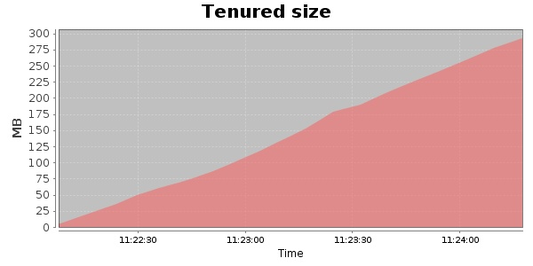
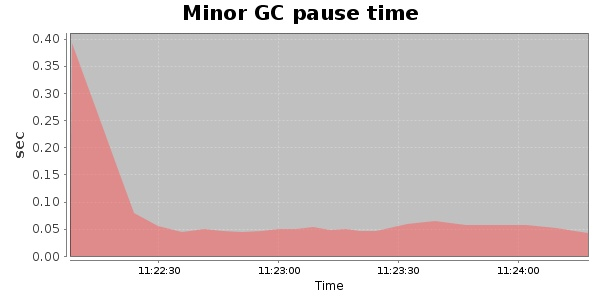
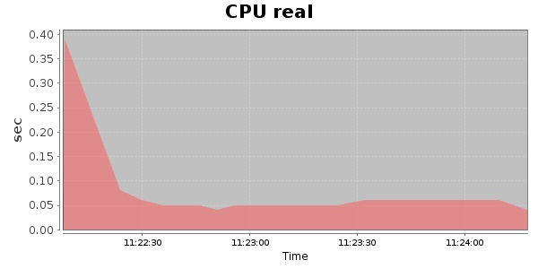
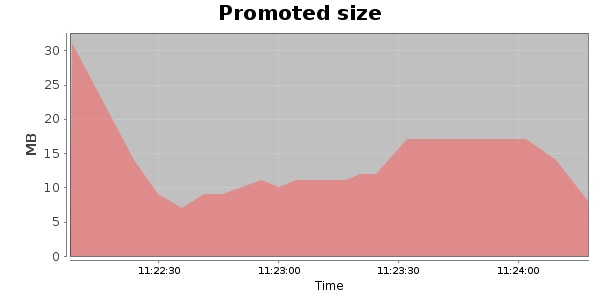
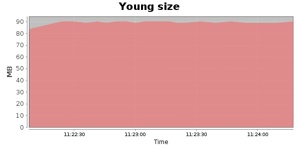

### JMeter-2.9 1000 Users
#### https://flood.io/92414be786899f
#### Apdex 0.96 [4000]
This flood simulated up to 1,000 concurrent users for 2 minutes on  2013-10-02 11:22:00 UTC from Australia (Sydney). A mean response time of 1,589 ms was observed with a standard deviation of 174 ms. The 95th percentile was 1,711 ms and the 50th percentile (median) was 1,667 ms. A mean throughput of 106 kbps was observed with a peak of 211 kbps. A total of 2.33 MB was transferred. A total of 4,641 requests were successfully simulated with no errors observed. The mean request rate was 2,320.00 rpm. 

\
\
\
\
\

