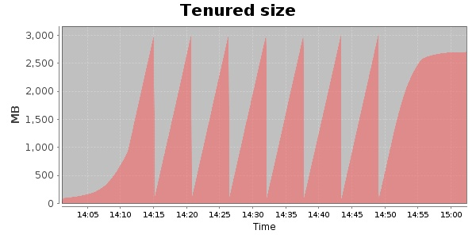
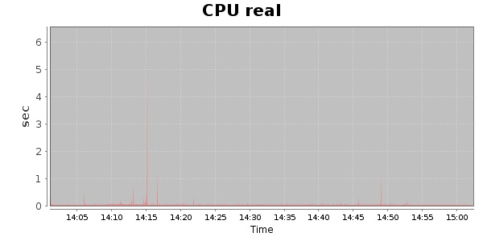
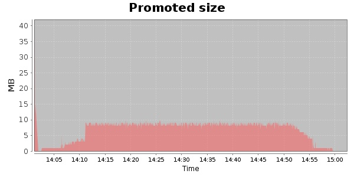
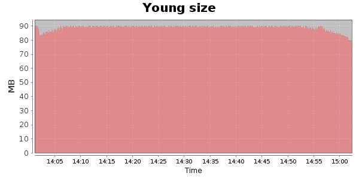

### Gatling-1.5.3 10000 Users
#### https://flood.io/9323a04545be43
#### Apdex 0.95 [4000]
This flood simulated up to 10,000 concurrent users for about 1 hour on  2013-10-04 14:01:00 UTC from Australia (Sydney). A mean response time of 1,710 ms was observed with a standard deviation of 18 ms. The 95th percentile was 1,728 ms and the 50th percentile (median) was 1,708 ms. A mean throughput of 217 kbps was observed with a peak of 1.35 Mbps. A total of 96.9 MB was transferred. A total of 1,800,182 requests were successfully simulated with an error rate of 0.0% observed. The mean request rate was 30,004.00 rpm. 

\
\
\
\
\

