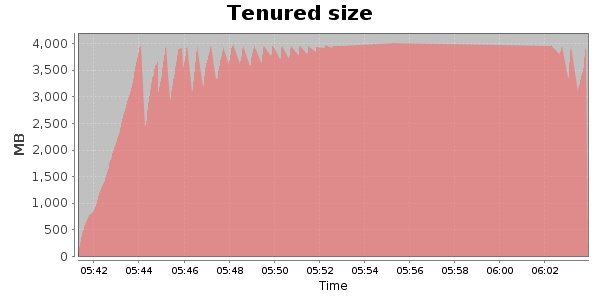
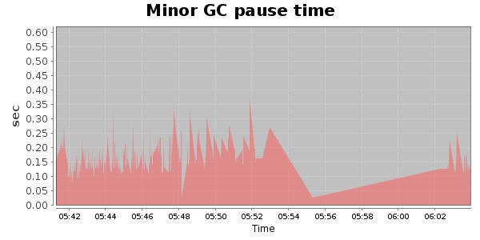
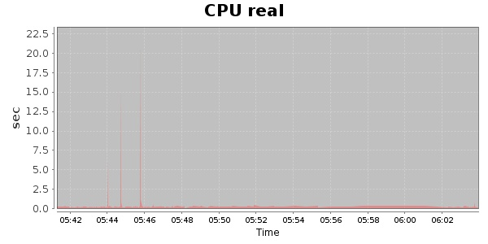
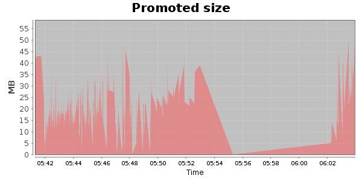
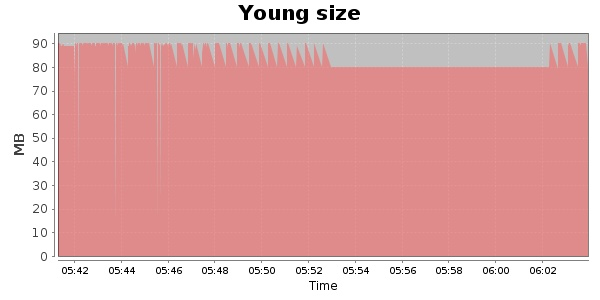

### JMeter-2.9 30000 Users
#### https://flood.io/954b7d5d79f134
#### Apdex 0.24 [4000]
This flood simulated up to 30,000 concurrent users for 21 minutes on  2013-10-04 05:42:00 UTC from Australia (Sydney). A mean response time of 238,395 ms was observed with a standard deviation of 238,604 ms. The 95th percentile was 617,407 ms and the 50th percentile (median) was 170,004 ms. A mean throughput of 455 kbps was observed with a peak of 1.41 Mbps. A total of 73.3 MB was transferred. A total of 159,085 requests were successfully simulated with no errors observed. The mean request rate was 7,575.00 rpm. 

\
\
\
\
\

