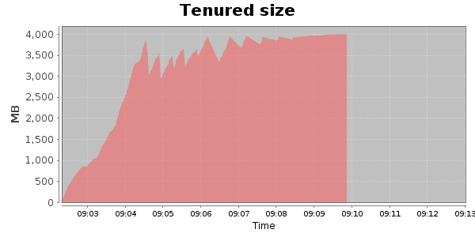
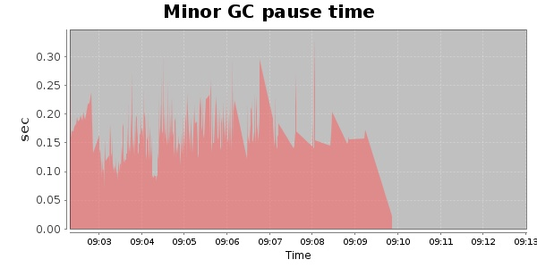
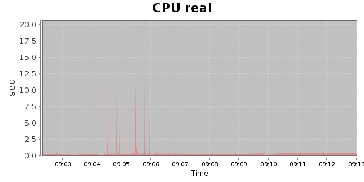
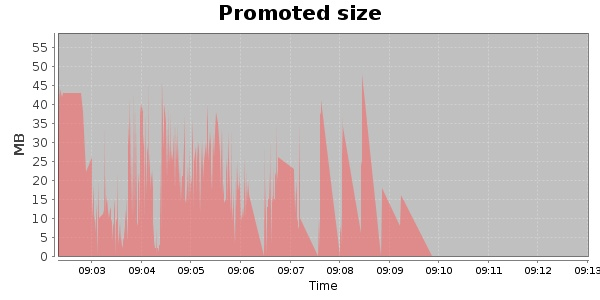
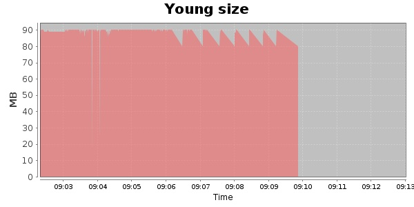

### JMeter-2.9 Kludge 30000 Users
#### https://flood.io/95c0b87dab34e4
#### Apdex 0.32 [4000]
This flood simulated up to 32,141 concurrent users for 9 minutes on  2013-10-05 09:03:00 UTC from Australia (Sydney). A mean response time of 85,491 ms was observed with a standard deviation of 80,285 ms. The 95th percentile was 235,939 ms and the 50th percentile (median) was 58,843 ms. A mean throughput of 560 kbps was observed with a peak of 1.54 Mbps. A total of 41 MB was transferred. A total of 63,780 requests were successfully simulated with no errors observed. The mean request rate was 7,086.00 rpm. 

\
\
\
\
\

