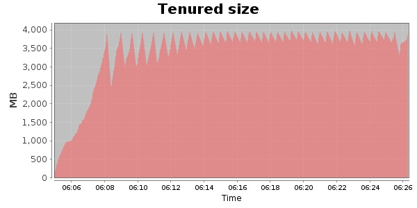
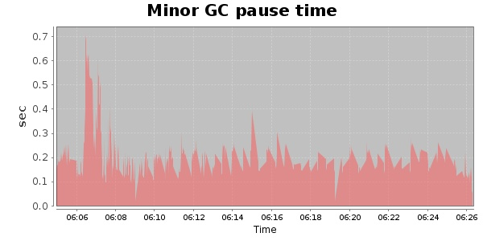
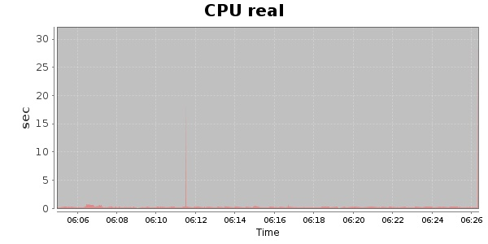
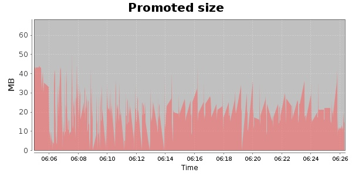

### JMeter-r1529062 30000 Users
#### https://flood.io/962be9007851f2
#### Apdex 0.18 [4000]
This flood simulated up to 30,000 concurrent users for 20 minutes on  2013-10-04 06:05:00 UTC from Australia (Sydney). A mean response time of 39,645 ms was observed with a standard deviation of 21,725 ms. The 95th percentile was 63,477 ms and the 50th percentile (median) was 46,338 ms. A mean throughput of 595 kbps was observed with a peak of 1.57 Mbps. A total of 91.6 MB was transferred. A total of 215,859 requests were successfully simulated with no errors observed. The mean request rate was 10,792.00 rpm. 

\
\
\
\
\

