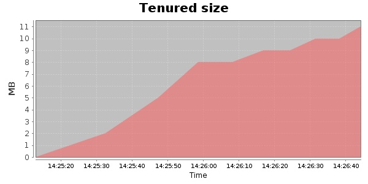
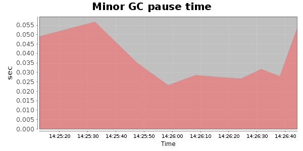
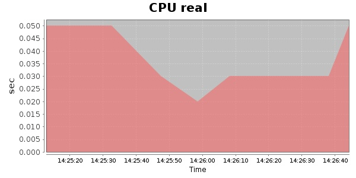
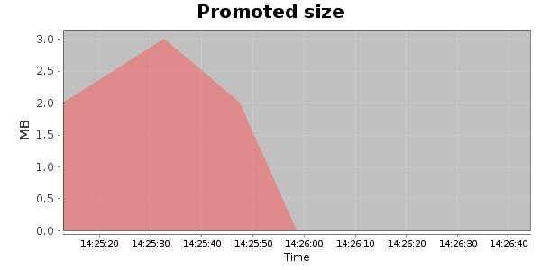
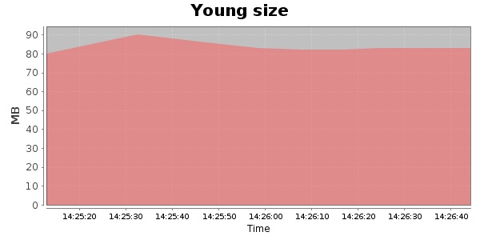

### Gatling-2.0.0-20131003.084332-335-bundle 10000 Users
#### https://flood.io/980d1ab0f68627
#### Apdex 0.95 [4000]
This flood simulated up to 1,530 concurrent users for 1 minute on  2013-10-05 14:25:00 UTC from Australia (Sydney). A mean response time of 1,733 ms was observed with a standard deviation of 164 ms. The 95th percentile was 1,849 ms and the 50th percentile (median) was 1,733 ms. A mean throughput of 625 kbps was observed with a peak of 895 kbps. A total of 9.15 MB was transferred. A total of 4,429 requests were successfully simulated with no errors observed. The mean request rate was 4,429.00 rpm. 

\
\
\
\
\

