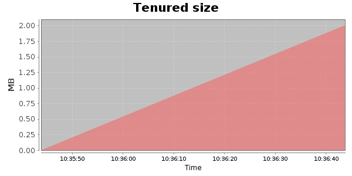
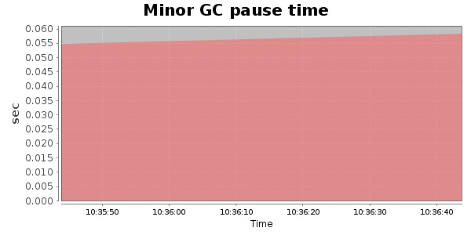
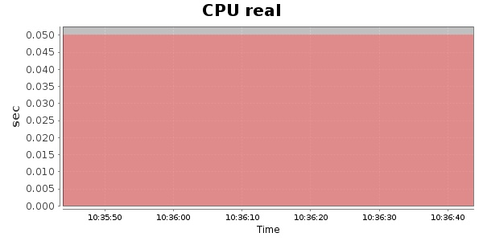
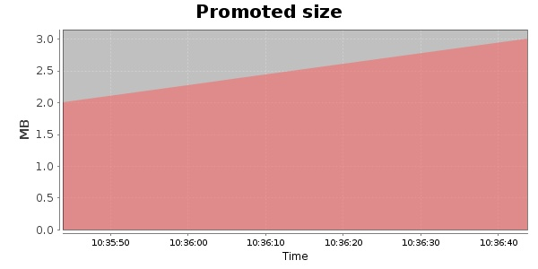
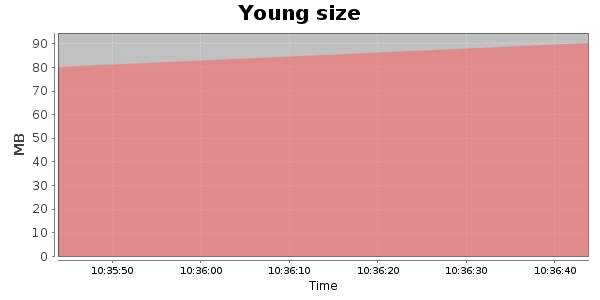

### Gatling-2.0.0-20131001.201622-332-bundle 100 Users
#### https://flood.io/9d32af84735887
#### Apdex 0.96 [4000]
This flood simulated up to 99 concurrent users for 2 minutes on  2013-10-02 10:35:00 UTC from Australia (Sydney). A mean response time of 1,638 ms was observed with a standard deviation of 229 ms. The 95th percentile was 1,868 ms and the 50th percentile (median) was 1,635 ms. A mean throughput of 35 kbps was observed with a peak of 66 kbps. A total of 796 KB was transferred. A total of 524 requests were successfully simulated with no errors observed. The mean request rate was 262.00 rpm. 

\
\
\
\
\

