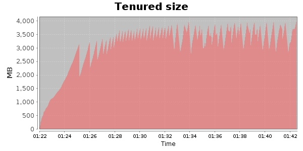
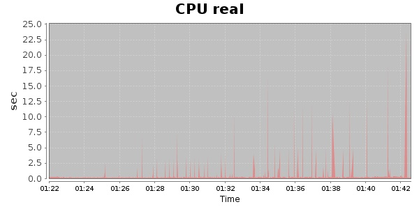
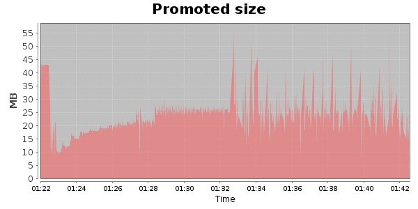
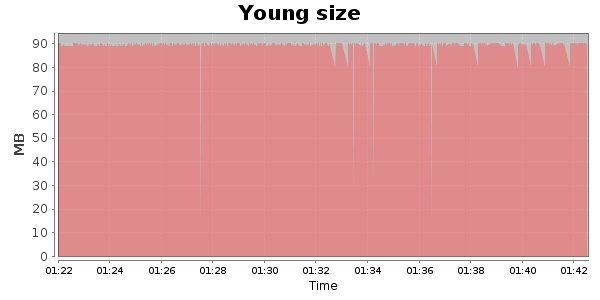

### JMeter-2.10 20000 Users
#### https://flood.io/9e64d234da00ea
#### Apdex 0.9 [4000]
This flood simulated up to 20,000 concurrent users for 20 minutes on  2013-10-02 01:22:00 UTC from Australia (Sydney). A mean response time of 2,179 ms was observed with a standard deviation of 856 ms. The 95th percentile was 4,004 ms and the 50th percentile (median) was 1,759 ms. A mean throughput of 1.16 Mbps was observed with a peak of 1.68 Mbps. A total of 182 MB was transferred. A total of 590,750 requests were successfully simulated with no errors observed. The mean request rate was 29,537.00 rpm. 

\
\
\
\
\

