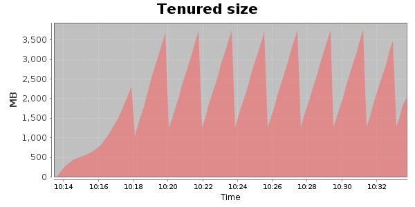
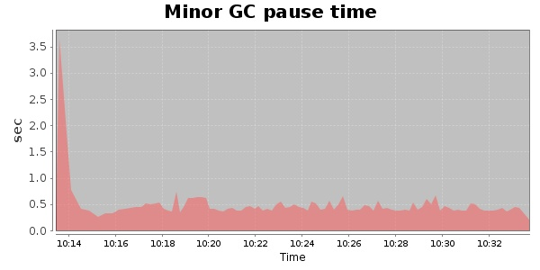
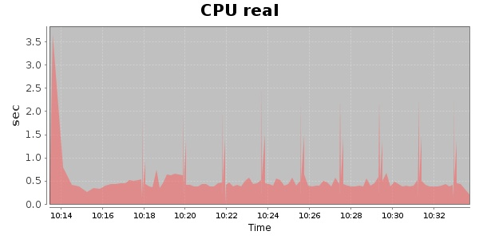
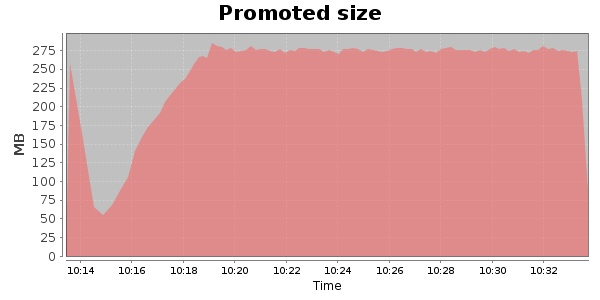
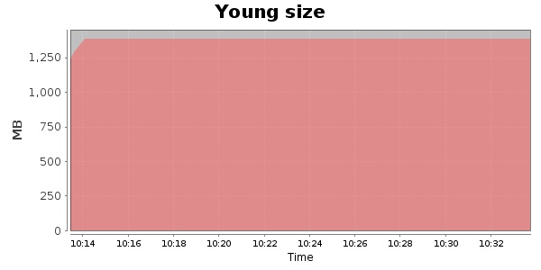

### JMeter-2.10 10000 Users
#### https://flood.io/9fde49a2f3d43b
#### Apdex 0.95 [4000]
This flood simulated up to 10,000 concurrent users for 19 minutes on  2013-09-30 10:14:00 UTC from Australia (Sydney). A mean response time of 1,698 ms was observed with a standard deviation of 31 ms. The 95th percentile was 1,720 ms and the 50th percentile (median) was 1,711 ms. A mean throughput of 1.19 Mbps was observed with a peak of 1.48 Mbps. A total of 178 MB was transferred. A total of 619,078 requests were successfully simulated with no errors observed. The mean request rate was 32,583.00 rpm. 

Young size collected: 122 GB
Young size collected: 102.954 MB/s
Total size collected by minor GC: 97 GB
Total size collected by minor GC: 82.116 MB/s
Promoted size: 24 GB
Promoted size: 20.838 MB/s
Cpu Minor GC real: 3.94%
Cpu Major GC total processors: 11.86%
Cpu Major GC real: 3.16%
Cpu Major GC total processors: 4.98%

\
\
\
\
\

