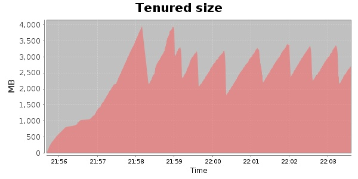
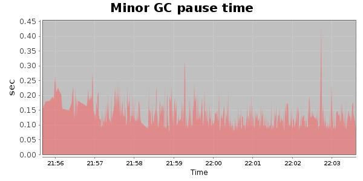
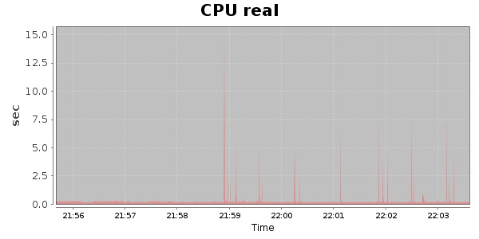
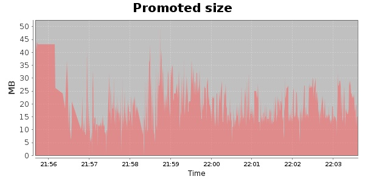
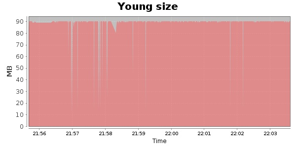

### JMeter-2.9 Kludge 30000 Users
#### https://flood.io/a0542103d3f2d5
#### Apdex 0.8 [4000]
This flood simulated up to 19,344 concurrent users for 7 minutes on  2013-10-05 21:56:00 UTC from Australia (Sydney). A mean response time of 3,825 ms was observed with a standard deviation of 3,707 ms. The 95th percentile was 11,747 ms and the 50th percentile (median) was 1,901 ms. A mean throughput of 1.36 Mbps was observed with a peak of 1.98 Mbps. A total of 81.7 MB was transferred. A total of 146,256 requests were successfully simulated with no errors observed. The mean request rate was 20,893.00 rpm. 

\
\
\
\
\

