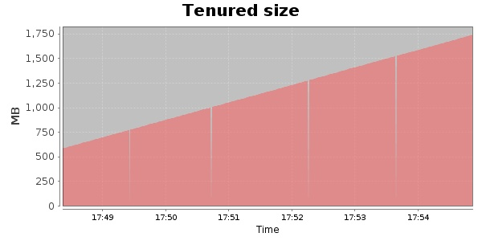
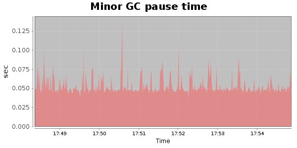
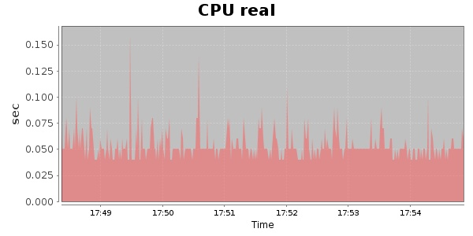
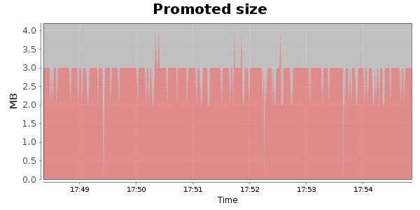
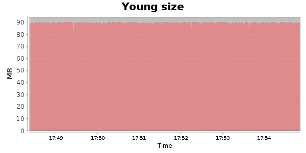

### Gatling-2.0.0-20131001.201622-332-bundle 10000 Users
#### https://flood.io/a13baf1f8fcb89
#### Apdex 0.95 [4000]
This flood simulated up to 9,999 concurrent users for 6 minutes on  2013-10-02 17:48:00 UTC from Australia (Sydney). A mean response time of 1,700 ms was observed with a standard deviation of 25 ms. The 95th percentile was 1,747 ms and the 50th percentile (median) was 1,697 ms. A mean throughput of 0 bps was observed with a peak of 0 bps. A total of 0 Bytes was transferred. A total of 235,000 requests were successfully simulated with no errors observed. The mean request rate was 39,166.00 rpm. 

\
\
\
\
\

