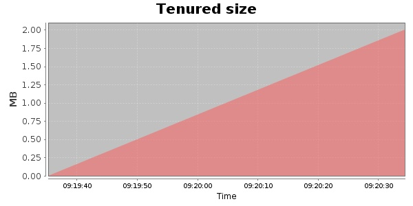
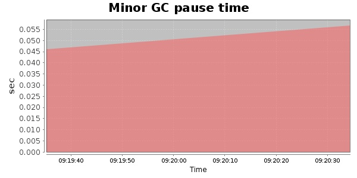
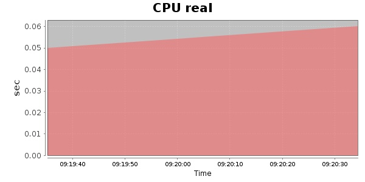
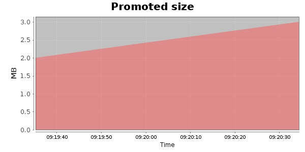
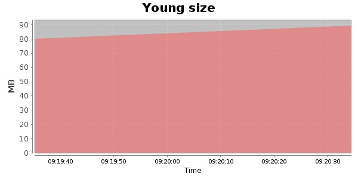

### Gatling-2.0.0-20131001.201622-332-bundle 100 Users
#### https://flood.io/a6ea0d1aea6ba6
#### Apdex 0.96 [4000]
This flood simulated up to 99 concurrent users for 2 minutes on  2013-10-02 09:19:00 UTC from Australia (Sydney). A mean response time of 1,690 ms was observed with a standard deviation of 303 ms. The 95th percentile was 2,039 ms and the 50th percentile (median) was 1,527 ms. A mean throughput of 33 kbps was observed with a peak of 53 kbps. A total of 736 KB was transferred. A total of 526 requests were successfully simulated with no errors observed. The mean request rate was 263.00 rpm. 

\
\
\
\
\

