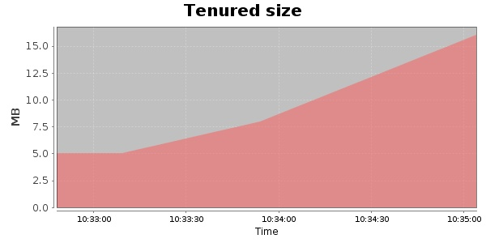
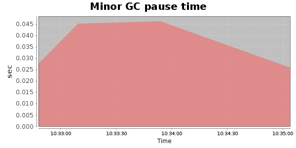
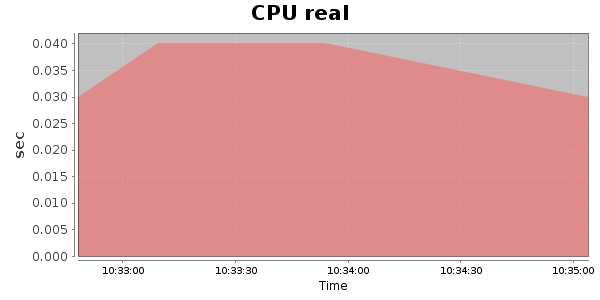
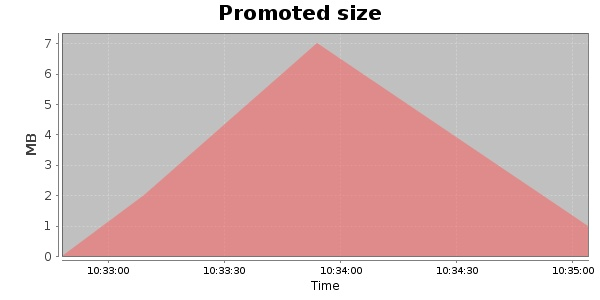
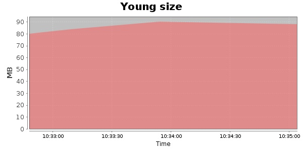

### JMeter-r1528295 100 Users
#### https://flood.io/a7d55f2a8d313b
#### Apdex 0.96 [4000]
This flood simulated up to 100 concurrent users for 1 minute on  2013-10-02 10:33:00 UTC from Australia (Sydney). A mean response time of 1,600 ms was observed with a standard deviation of 21 ms. The 95th percentile was 1,615 ms and the 50th percentile (median) was 1,600 ms. A mean throughput of 17 kbps was observed with a peak of 28 kbps. A total of 258 KB was transferred. A total of 527 requests were successfully simulated with no errors observed. The mean request rate was 527.00 rpm. 

\
\
\
\
\

