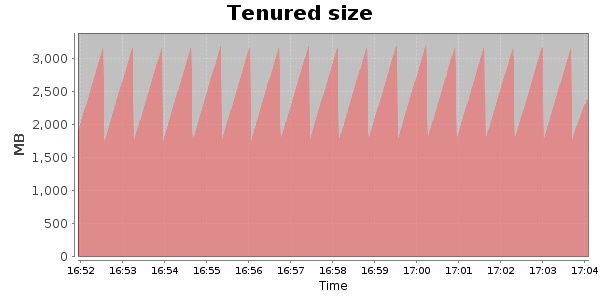
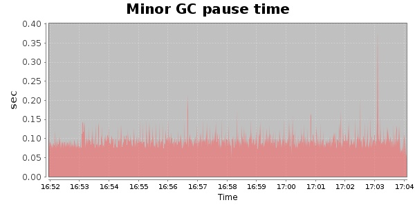
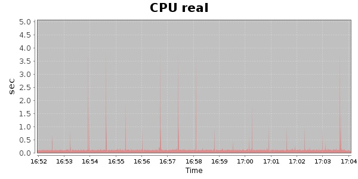
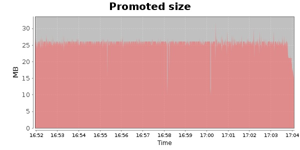

### JMeter-r1528295 10000 Users
#### https://flood.io/ab2d479bfd2fc5
#### Apdex 0.95 [4000]
This flood simulated up to 10,000 concurrent users for 13 minutes on  2013-10-02 16:51:00 UTC from Australia (Sydney). A mean response time of 1,643 ms was observed with a standard deviation of 350 ms. The 95th percentile was 2,065 ms and the 50th percentile (median) was 1,712 ms. A mean throughput of 1.02 Mbps was observed with a peak of 1.28 Mbps. A total of 107 MB was transferred. A total of 396,366 requests were successfully simulated with no errors observed. The mean request rate was 30,489.00 rpm. 

\
\
\
\
\

