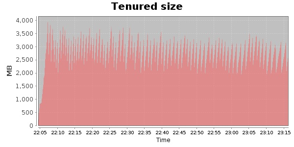
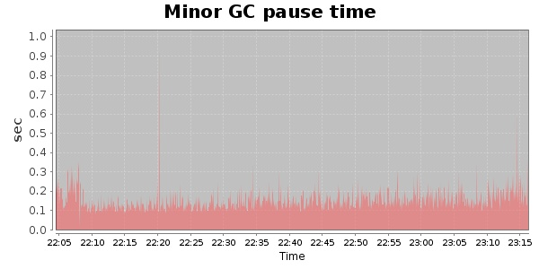
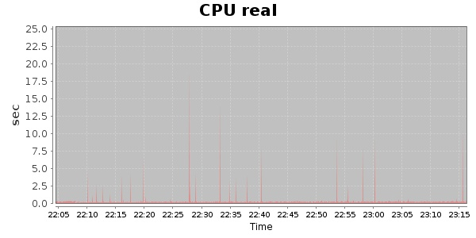
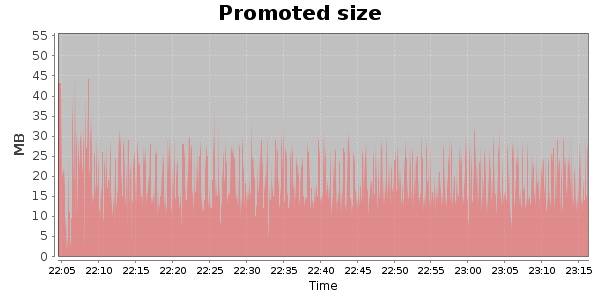
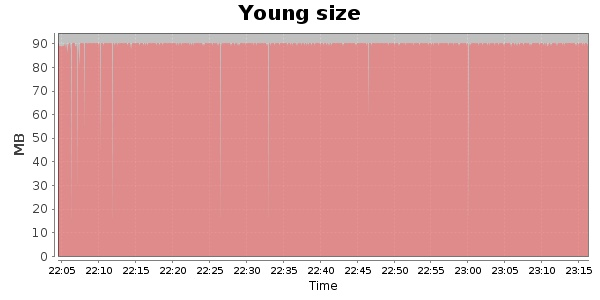

### JMeter-2.9 Kludge 30000 Users
#### https://flood.io/aeb3bffd64ab4b
#### Apdex 0.9 [4000]
This flood simulated up to 20,451 concurrent users for about 1 hour on  2013-10-05 22:06:00 UTC from Australia (Sydney). A mean response time of 2,654 ms was observed with a standard deviation of 4,399 ms. The 95th percentile was 2,057 ms and the 50th percentile (median) was 1,861 ms. A mean throughput of 1.23 Mbps was observed with a peak of 2.06 Mbps. A total of 655 MB was transferred. A total of 1,223,890 requests were successfully simulated with no errors observed. The mean request rate was 17,484.00 rpm. 

\
\
\
\
\

