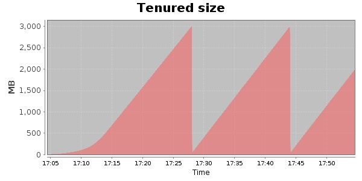
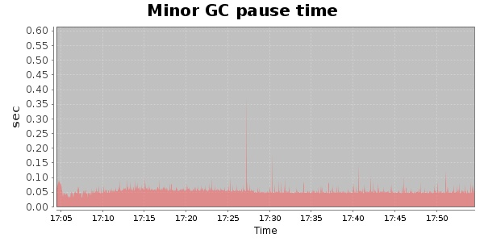
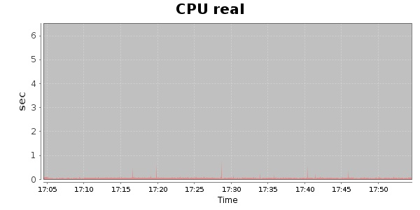
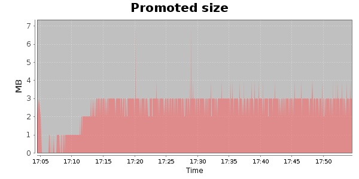
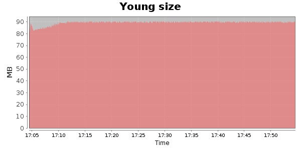

### Gatling-2.0.0-20131003.084332-335-bundle 10000 Users
#### https://flood.io/b3daa344b159d2
#### Apdex 0.95 [4000]
This flood simulated up to 9,999 concurrent users for about 1 hour on  2013-10-06 17:04:00 UTC from Australia (Sydney). A mean response time of 1,707 ms was observed with a standard deviation of 30 ms. The 95th percentile was 1,718 ms and the 50th percentile (median) was 1,704 ms. A mean throughput of 257 kbps was observed with a peak of 1.33 Mbps. A total of 96.1 MB was transferred. A total of 1,615,887 requests were successfully simulated with no errors observed. The mean request rate was 32,317.00 rpm. 

\
\
\
\
\

